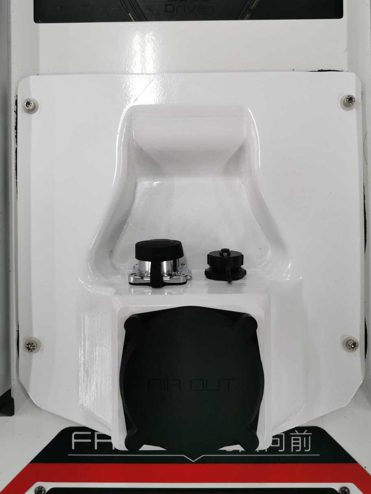
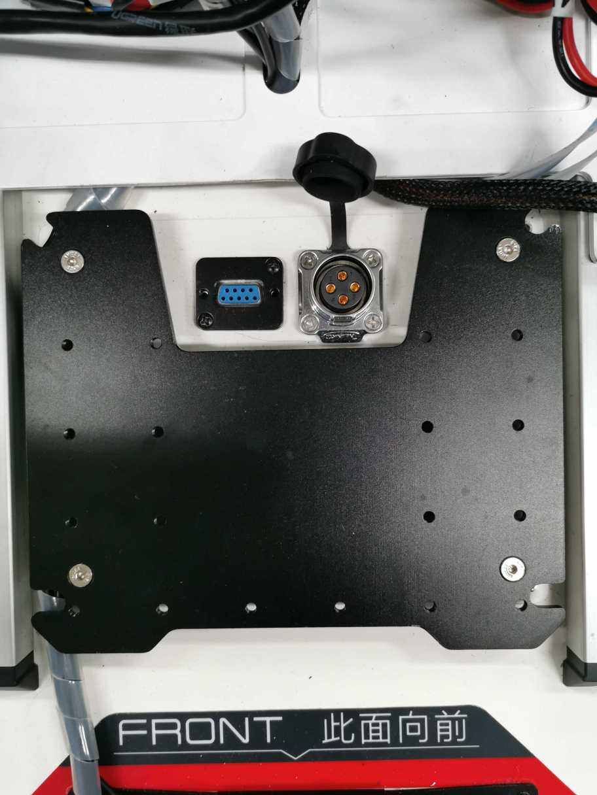
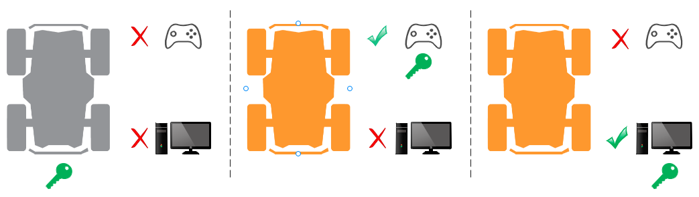
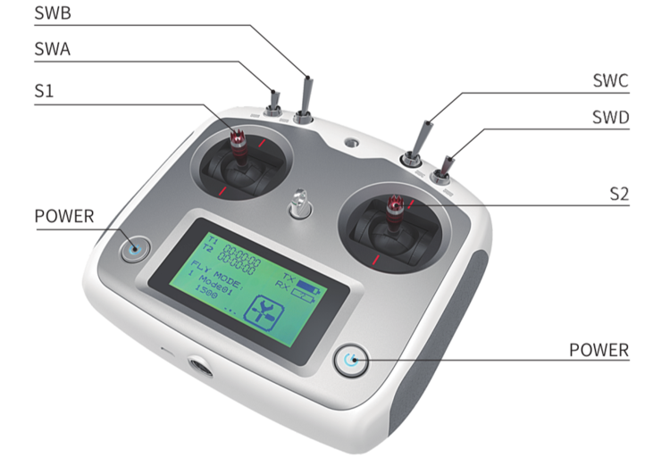
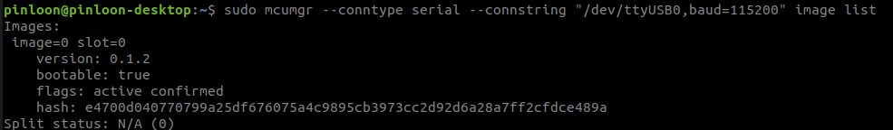
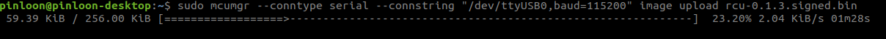
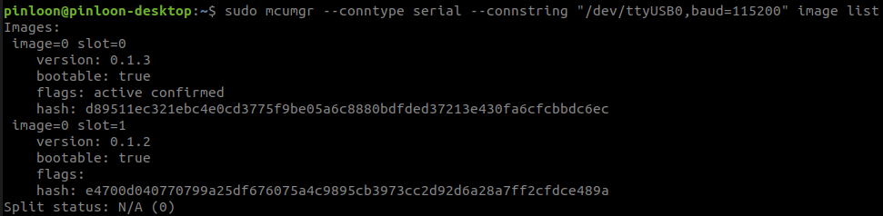

*********************
Scout V2.5 User Guide
*********************

1. Summary of Changes
=====================

1.1 Hardware Modifications
--------------------------

+---------------------+---------------------+------------------+
|        Item         |       Current       | Previous (V2.0)  |
+=====================+=====================+==================+
| Top Interface Panel | CAN+POWER, MicroUSB | CAN+POWER, RS232 |
+---------------------+---------------------+------------------+
| Motor Driver        | 2-in-1 Driver x 2   | Driver x 4       |
+---------------------+---------------------+------------------+
| Battery             | 24V, 60Ah           | 24V, 30Ah        |
+---------------------+---------------------+------------------+

- The pinout of CAN+POWER connector remains the same:
   - Pin 1 - Vcc (23V - 26.5V)
   - Pin 2 - GND
   - Pin 3 - CAN High
   - Pin 4 - CAN Low
- MicroUSB port is for firmware upgrade only

1.2 Software Updates
--------------------

- Updated CAN communication protocol 
- Deprecated RS232 support for robot control and monitoring
- Introduced the concept of control token for enhanced safety of robot operation
- The SDK is now provided as a Debian package for easy and convenient installation
- The ROS interface is provided with the "wr_mobilerobot_ros" package

2. Control Token
================

    
The robot can be controlled **manually** with a remote controller or **programatically** through the CAN interface from a Linux computer. Previously, there was no explicit way for the onboard computer (the navigation system) to know whether it can control the robot base or not and possible reasons why the robot doesn't move even though it has commanded the robot to do so. We introduced the concept of control token to provide finer access control of the the robot base

- There is only one control token available and the token is initially held by the robot controller (command from either remote controller or CAN bus will not be responded)
- Only the entity who has gained the control token will be able to control the robot to move
- The remote controller has a higher priority to take the control token than the CAN bus. This means the operator can always take over control from the onboard computer using the remote controller
- You can register a callback function through the SDK to get notified when the control token is taken away. Please note that you need to keep callback function short and non-blocking. This callback function is supposed to be a notifier only and complicated handling functionalities should not be implemented inside
- Once the operator has finished manual control, the operator can switch the control mode back to **standby** and the control token will be returned to the robot controller.  (Switching off of remote controlle will return the control token to the robot controller as well). The SDK will have to request to gain the control token again to resume control 
- An error code will be returned to the user if the SDK fails to gain the control. Possible reasons include hardware failture, robot in manual control mode etc.
- Only **one **SDK instance **or** ROS node** **is allowed to communicate with the robot at a time

With the introduced control token concept, the functional mappings of "**SWA**" and "**SWB**" on the remote controller are slightly different:

- Initally **SWB** stays at the up position and the robot is in standby mode (control token kept by the robot)
- The remote controller will gain the control token by placing **SWB** at the middle position, setting the robot to be in the manual control mode
- Once the operator has finished manual control, the operator can switch the control mode back to **standby** by placing **SWB to up** position  (Switching off the remote controller will return the control token to the robot controller as well). 
- **SWA** acts as a wireless E-Stop. If **SWA **is switched to **down position,** the control token will remain at robot controller, **neither remote controller** **nor SDK **would be able to control the robot until **SWA **is returned to **up **position 

3. Key Operation Information
============================

3.1 System State Message
------------------------

Key information about the robot can be extracted from the system state message:

1. **rc_connected**: indicates whether remote controller is connected
   
   - 1 - RC connected
   - 0 - RC disconnected
  
2. **error_code**: system error or fault code
   
   - Please refer to Table 3.2.1 below for detailed error code meaning
  
3. **operational_state**: possible states and explanations are listed in the following table

+-------+-------------------+----------------------------------+
| Value | Operational state |            Situation             |
+=======+===================+==================================+
| 0x00  | OPERATIONAL       | Robot is at normal operation     |
+-------+-------------------+----------------------------------+
| 0x01  | INITIALIZATION    | Robot is starting up             |
+-------+-------------------+----------------------------------+
| 0x02  | MAINTENANCE       | Not applicable for now           |
+-------+-------------------+----------------------------------+
| 0x03  | SOFTWARE_UPDATE   | Not applicable for now           |
+-------+-------------------+----------------------------------+
| 0x04  | ESTOP_ACTIVATED   | Emergency stop button is pressed |
+-------+-------------------+----------------------------------+
| 0x05  | HARDWARE_FAULT    | There is fault error code        |
+-------+-------------------+----------------------------------+

4. **ctrl_state**: indicates which entity is in control of the robot

+-------+---------------------+-----------------------------------------------------------+
| Value |  Operational state  |                         Situation                         |
+=======+=====================+===========================================================+
| 0x00  | UNINITIALIZED       | Robot is starting up / recover from estop                 |
+-------+---------------------+-----------------------------------------------------------+
| 0x01  | STANDBY             | Robot is ready to be controlled                           |
+-------+---------------------+-----------------------------------------------------------+
| 0x02  | RC_HALT_TRIGGERED   | Robot is halted by remote controller (SWA is pushed down) |
+-------+---------------------+-----------------------------------------------------------+
| 0x03  | RC_MANUAL_CONTROL   | Robot is controlled by remote controller                  |
+-------+---------------------+-----------------------------------------------------------+
| 0x04  | CAN_COMMAND_CONTROL | Robot is controlled by SDK/ROS                            |
+-------+---------------------+-----------------------------------------------------------+

5. battery-state
   
   - contains information about battery voltage

**Note**: There are other feedback messages available in addition to the system state message. Please refer to the ROS package message definitions for more details.

3.2 Buzzer Alert
----------------

- There are two levels of alert: **Warn** and **Fault**. You can still control the robot when you get a **warn**-level alert but once a **fault**-level alert is triggered, the robot will stop and not respond to any motion commands to avoid possible hardware damage.
- Warn-level alert: buzzer will be triggered at a relatively **low frequency** (0.5Hz)
   - The robot **can still be controlled**, but the warning (buzzer) will remain until none of the **warning** conditions from Table 1.1 exist
   - It is advised to take proper actions to get the robot back to normal
- Fault-level alert: buzzer will be triggered **at higher frequency** (2Hz)
   - The robot **cannot be controlled** until all **faults **are resolved
   - For recoverable faults (e.g. over-heating), the robot may first recover back to warn-level condition before returning to normal, given enough time for cooling
- Conditions that may trigger the alert are listed below
  
+---------------------+-----------------------------+----------------------------------------------+-----------------+------------------+
|      Condition      |            Warn             |                    Fault                     | Warn error code | Fault error code |
+=====================+=============================+==============================================+=================+==================+
| Battery             | State of Charge (SOC) < 25% | State of Charge (SOC) < 15%                  | 0x00000001      | 0x00010000       |
+---------------------+-----------------------------+----------------------------------------------+-----------------+------------------+
| Motor Temperature   | > 70 °C                     | > 100 °C                                     | 0x00000002      | 0x00020000       |
+---------------------+-----------------------------+----------------------------------------------+-----------------+------------------+
| Motor Current       | > 25 A                      | continuous 100A for 3ms (reported by driver) | 0x00000004      | 0x00040000       |
+---------------------+-----------------------------+----------------------------------------------+-----------------+------------------+
| Motor Communication | Not applicable              | Lost communication with motor drivers        | Not applicabl   | 0x00080000       |
+---------------------+-----------------------------+----------------------------------------------+-----------------+------------------+

**Table 3.2.1 Robot Warning and Fault Conditions**

4. Software Packages
====================

- Sample code for wrp_sdk
  - https://github.com/westonrobot/sdk_sample
- ROS support packages
  - https://github.com/westonrobot/wr_mobilerobot_ros

**Note**: Scout V2.5 is incompatible with ugv_sdk and scout_ros.

5. Preview Feature
==================

System state monitor with Bluetooth. You can download any Bluetooth serial terminal application to receive basic robot state information. We have tested the following app and you can download it from Play store.

.. image:: figures/scout_v2.5_05.png
    :width: 350 px

You can scan Bluetooth devices **near the robot** and connect to the robot controller. The device name should be similar to "WR-SC210404".

.. image:: figures/scout_v2.5_06.jpg
    :width: 350 px
    
6. Firmware Upgrade
===================

- To upgrade the firmware, please ensure you have the following items
   - Laptop running on Ubuntu18.04
   - USB to Micro USB cable
   - Signed binary image from Weston Robot
   - MCU Manager installed (kindly refer for the installation guide below)

6.1 Installation guide for MCU Manager (mcumgr)
-----------------------------------------------

1. Installation for Go.

.. code-block:: bash

    $ sudo apt install golang-go

2. Verify whether Go is installed properly by the following command.

.. code-block:: bash

    $ go version

3. Now you can install mcumgr CLI.

.. code-block:: bash

    $ cd 
    $ go get github.com/apache/mynewt-mcumgr-cli/mcumgr
    $ nano ~/.bashrc

1. Add in path for mcumgr into .bashrc file

.. code-block:: bash

    $ export PATH=$PATH:<path-to-home-directory>/go/bin/
    $ alias sudo='sudo env PATH=$PATH'

5. Verify whether mcumgr is installed properly by the following command.

.. code-block:: bash

    $ source ~/.bashrc
    $ mcumgr version

**Troubleshooting**

- If the installed golang-go is an older version, the "go get..." command in **step 3** might fail. To get around this error, manually install a newer version of go by following the instructions from golang's `website <https://golang.org/doc/install>`_ and reattempt installation from **step 3**.

6.2 Firmware upgrade using MCU Manager through USB cable
--------------------------------------------------------

- After you have installed mcumgr, now you should be able to upgrade the firmware through USB cable.
- Connect your computer to the MicroUSB port on robot using USB to Micro USB cable.
- Check on your computer for the device connected by the following command.

.. code-block:: bash

    $ ls /dev

- if there is only one USB device connected you should be able to see device named "ttyUSB0", if there are more instances such as "ttyUSB1", you can check the device using the following command. 

.. code-block:: bash

    $ sudo mcumgr <connection string> image list

The default connection string is 

.. code-block:: bash

    --conntype serial --connstring "/dev/ttyUSB0,baud=115200"

- You should be able to see something like below

- If you don't get any response, replace the connstring to other USB instance appeared on your computer such as "/dev/ttyUSB1,baud=115200".
- Assuming your USB device appeared on your computer is "/dev/ttyUSB0", you can upload the image with the following command.

.. code-block:: bash

    $ sudo mcumgr <connection string> image upload <path-to-signed.bin>

- Wait for about 3seconds, you should be able to see something like below

- Wait until the process is Done. 

.. image:: figures/scout_v2.5_08-2.png

- You can check whether the image is uploaded succesfully by the following command.

.. code-block:: bash

    $ sudo mcumgr <connection string> image list

.. image:: figures/scout_v2.5_09.png
    
- Copy the hash of latest image to be used in next step, in this example, it is  

.. code-block:: bash

    d89511ec321ebc4e0cd3775f9be05a6c8880bdfded37213e430fa6cfcbbdc6ec

- Now confirm the image by running the following command

.. code-block:: bash

    $ sudo mcumgr <connection string> image confirm <hash of image>

.. image:: figures/scout_v2.5_10.png

- Reset by the following command
  
.. code-block:: bash

    $ sudo mcumgr <connection string> reset

.. image:: figures/scout_v2.5_11.png

- Wait for about 30 seconds and run the following command

.. code-block:: bash

    $ sudo mcumgr <connection string> image list

- You should be able to see the following

- Now, you have upgraded the firmware successfully to a newer version.
- If you would like to revert the previous firmware, you can do so by confirming the image with hash of old image followed by a reset. 
