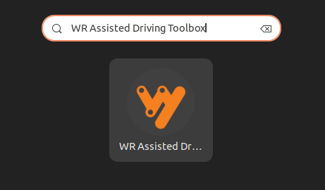
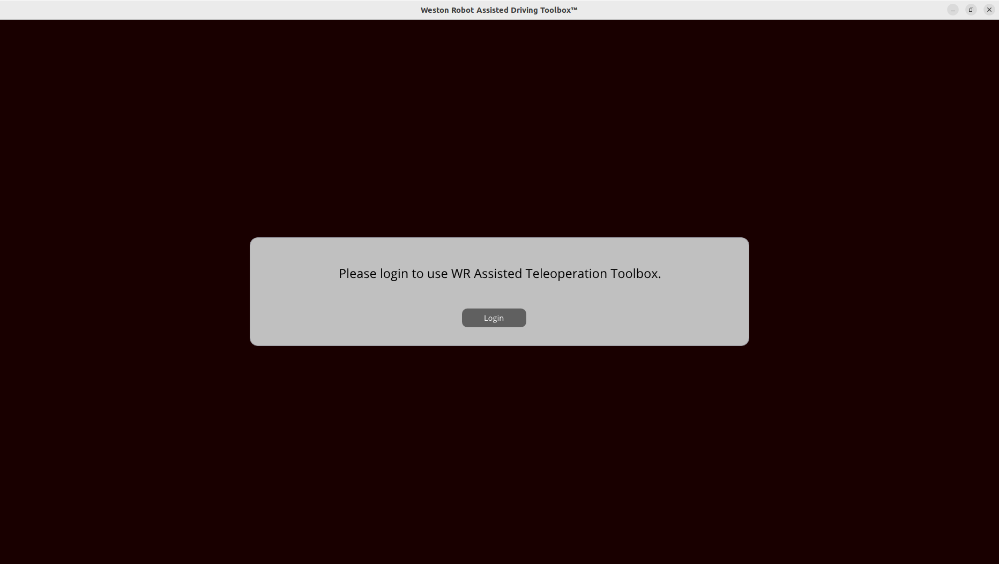
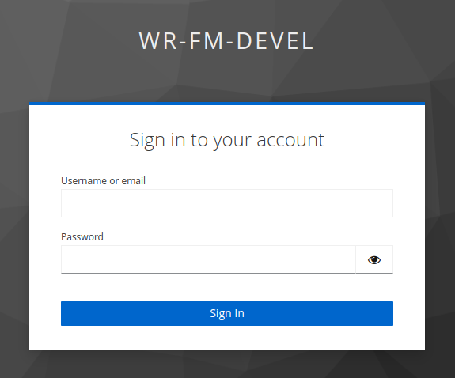
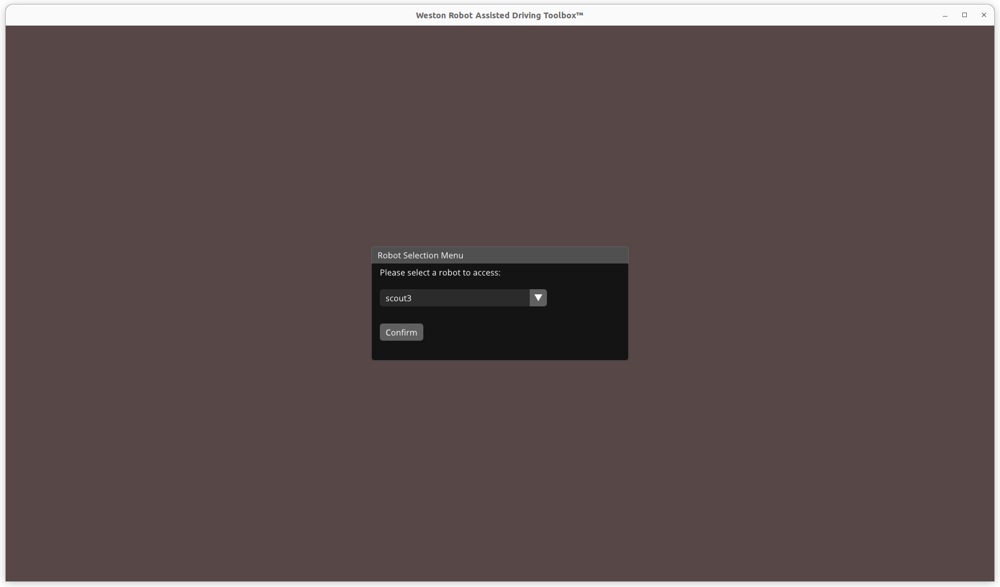

**********************************************
Weston Robot Assisted Driving Toolbox (ADT) V2
**********************************************

Weston Robot proudly presents the Assisted Driving Toolbox (ADT) V2, a teleoperation system designed and developed by Weston Robot for usage on multiple mobile robot platforms. The system allows the the control and operation of an robot through a shared network; with a wide coverage of its surroundings using mounted onboard camera modules.

Assisted Driving Client Setup
=============================

System Requirements
-------------------

1. Host computer running Ubuntu 20.04/22.04
2. Joystick for control via the Assisted Driving Toolbox Client
3. Shared network between the robot and host computer

Client Software Installation
----------------------------

.. note::
   We updated our apt-get server in July 2023. If you've added Weston Robot's old apt source before, you will need to remove it first.

    .. code-block:: bash

        $ sudo rm /etc/apt/sources.list.d/weston-robot.list

Follow these steps to install the Assisted Driving Toolbox Client on the host computer. If you have installed packages from the Weston Robot repository before, you can skip to step 3.

1. Add the GPG key for the Weston Robot repository:

.. code-block:: bash

    $ sudo install -m 0755 -d /etc/apt/keyrings
    $ sudo apt install curl
    $ curl -fsSL http://deb.westonrobot.net/signing.key | sudo gpg --dearmor -o /etc/apt/keyrings/weston-robot.gpg
    $ sudo chmod a+r /etc/apt/keyrings/weston-robot.gpg

2. Add the Weston Robot repository to your system's software repository list:

.. code-block:: bash

    $ echo \
        "deb [arch=$(dpkg --print-architecture) signed-by=/etc/apt/keyrings/weston-robot.gpg] http://deb.westonrobot.net/$(lsb_release -cs) $(lsb_release -cs) main" | \
        sudo tee /etc/apt/sources.list.d/weston-robot.list > /dev/null

3. Add the universe repository to your system's software repository list:

.. code-block:: bash

    $ sudo apt-add-repository universe

4. Now you can update the apt index and install the ADT package with "apt-get" command. 

.. code-block:: bash

    $ sudo apt-get update
    $ sudo apt-get install wr-ad-toolbox

**Note:** Installation of additional third-party dependency packages may be required for this package.

Running the Assisted Driving Toolbox Client
-------------------------------------------
To open the application, locate the Assisted Driving Toolbox Client in the application menu:

- Press the Windows key on your keyboard to open the application search bar. Search for "WR Assisted Driving Toolbox".
- Click on the application icon to open the Assisted Driving Toolbox Client.

The Assisted Driving Toolbox Client will open with the following screen:

Click on the "Login" button. A new browser window will open with the following login page:

Login with your credentials. After successful login, the Assisted Driving Toolbox Client will prompt you to select the robot you want to control:

If this is your first time using the Assisted Driving Toolbox Client, a settings menu will automatically open for you to configure the joystick and camera settings.

Key Application Features
------------------------
WIP.