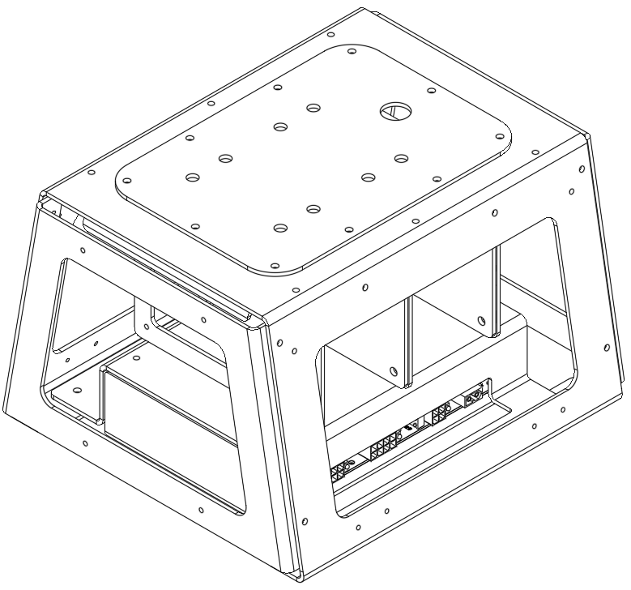
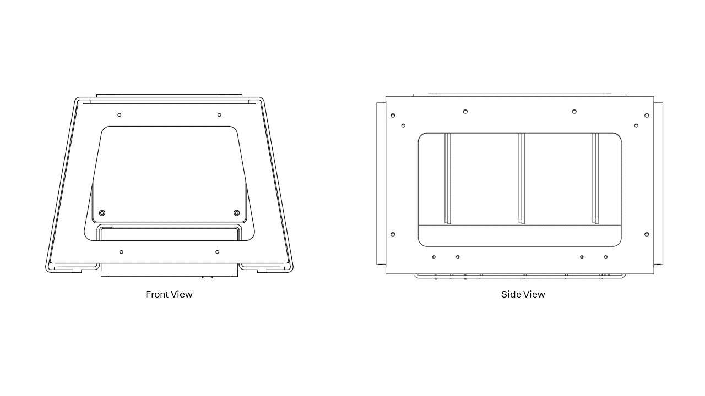
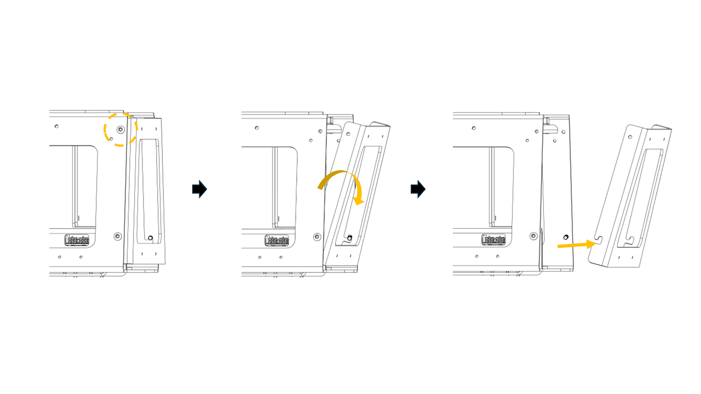
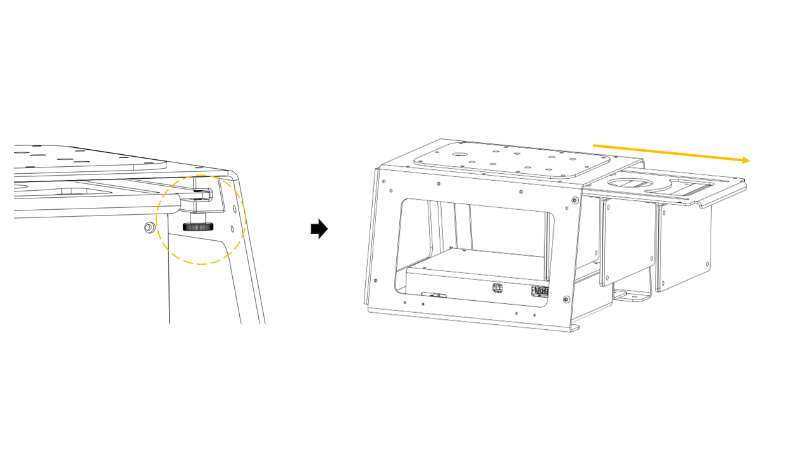

# UGV Devkit - Component Re-configuration

## Main Frame for Component Mounting

## Removal of Front/Rear Latches
- Remove fasteners (2 x M5 bolts) from top of case.
- Tilt latch outwards.
- Lift latch to separate it from main frame.

## Accessing Components in Kit
- Internal hardware/wiring can either be accessed through the side or by sliding out hardware rack
- To remove hardware rack:
    - Remove the locking thumb screw
    - Proceed to slide out rack

> **Note:** Please be reminded to remove connections such as power cables and connectivity ports before sliding out hardware rack!
