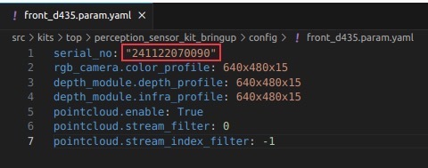
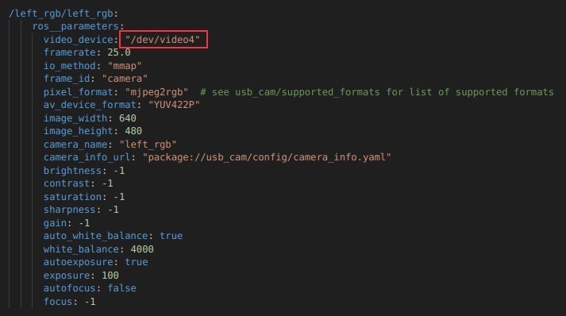
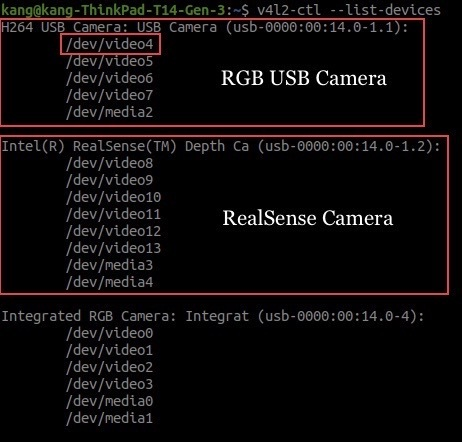

# Getting Started

## Connecting the Robot PC to your WiFi Network
The devkit is equipped with an Industrial 5G/WiFi Router and can act as an AP client to provide internet connectivity. Review the following guide and configure your router to connect to an existing WiFi network.

* [Industrial 5G/WiFi Router](/peripheral/network/industrial_5g_router)

## Connecting your PC to the Robot PC via SSH
You can control, deploy, launch, and debug applications from your PC. Alternatively, you can develop your applications directly on the robot PC by connecting a display, keyboard, and mouse to the robot PC or use a remote desktop application to access. 

1. Connect to the WiFi broadcasted by the the router in the devkit.
2. From your PC, open a terminal and run the following command to SSH into the robot PC. Enter the robot PC password when prompted (Refer to the handover note for the login credentials and the IP address of the Robot PC).
    ```
    ssh <USER>@<ROBOT_PC_IP>
    ```

> **Note**: Replace `<USER>` and `<ROBOT_PC_IP>` with the values for your robot. For example, `ssh wr@10.10.0.20`

## Camera Configuration
The devkit supports the installation of up to four cameras, which can be mounted at the front, rear, left, and right positions of the [Vision Sensor Kit](vision_extension.md). The supported camera types include RGB USB camera and RealSense D435i. Navigate to the `src/kits/top/perception_sensor_kit_bringup/config` folder. The configuration files are named according to the camera position and type. For example, the configuration file for the front RealSense D435i camera is named `front_d435i.param.yaml`. The following folder structure shows
the relevant files for configuring the cameras:

```
config
├── front_d435i.param.yaml
├── rear_d435i.param.yaml
├── left_d435i.param.yaml
├── right_d435i.param.yaml
└── rgb_camera.yaml
```

Based on the camera(s) you have installed, open the corresponding configuration file and adjust the parameters as necessary.

### RealSense Camera
For example, if you have a RealSense D435i connected at the front position, open the `front_d435i.param.yaml` file and replace `serial_no` with the serial number of your RealSense camera. To find the serial number of your RealSense camera(s) connected, enter `rs-enumerate-devices -s` in the terminal.



### RGB Camera
For example, if you have an RGB USB camera connected and mounted at the left position, open the `rgb_camera.yaml` file and enter the camera device file with its ID assigned by the kernel.



To find the device file ID, enter `v4l2-ctl --list-devices` in the terminal. If `v4l-utils` package is not installed, run `sudo apt-get install v4l-utils` to install it.


