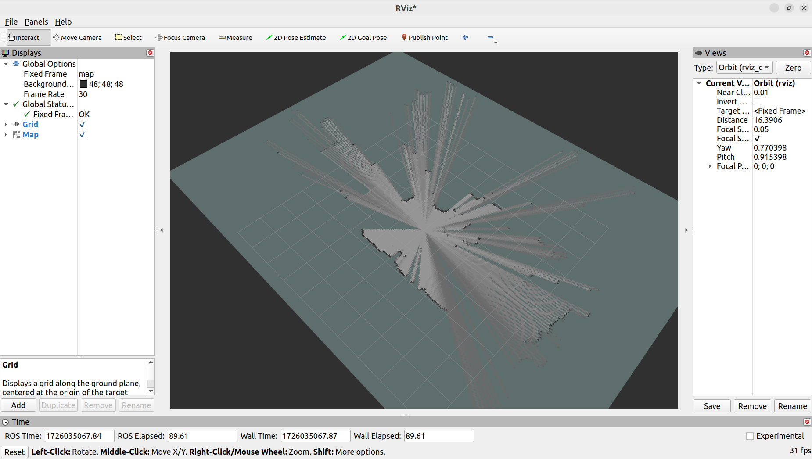
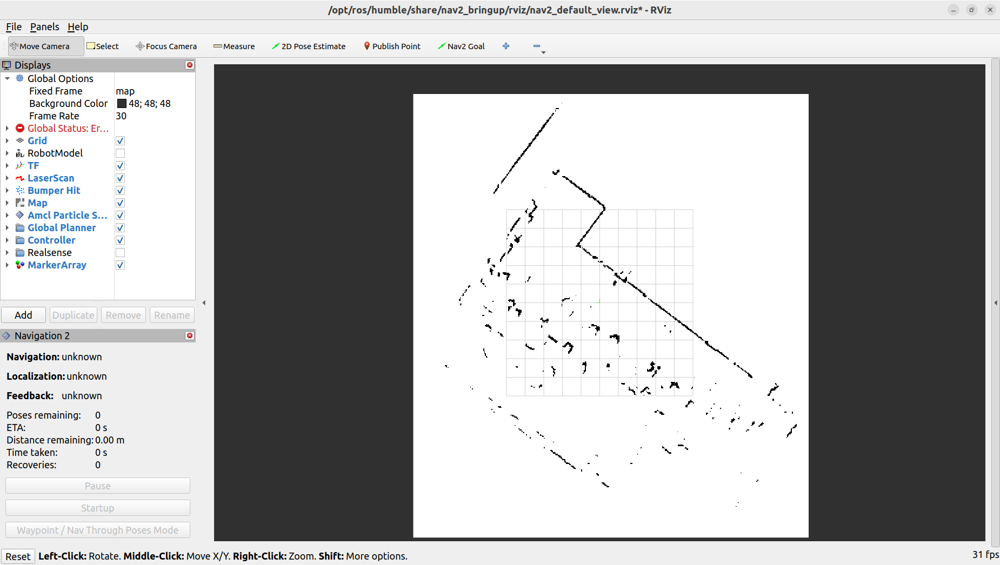
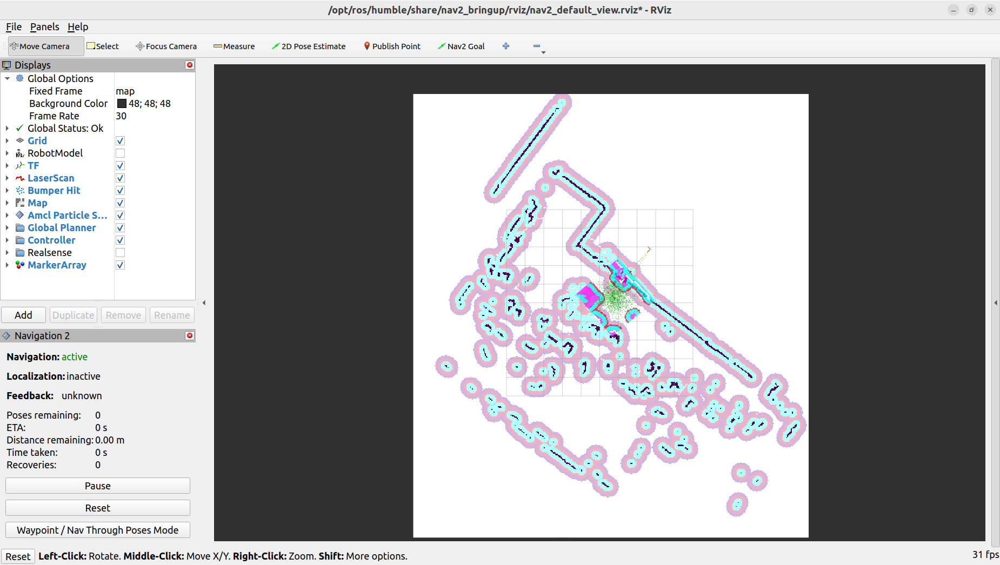
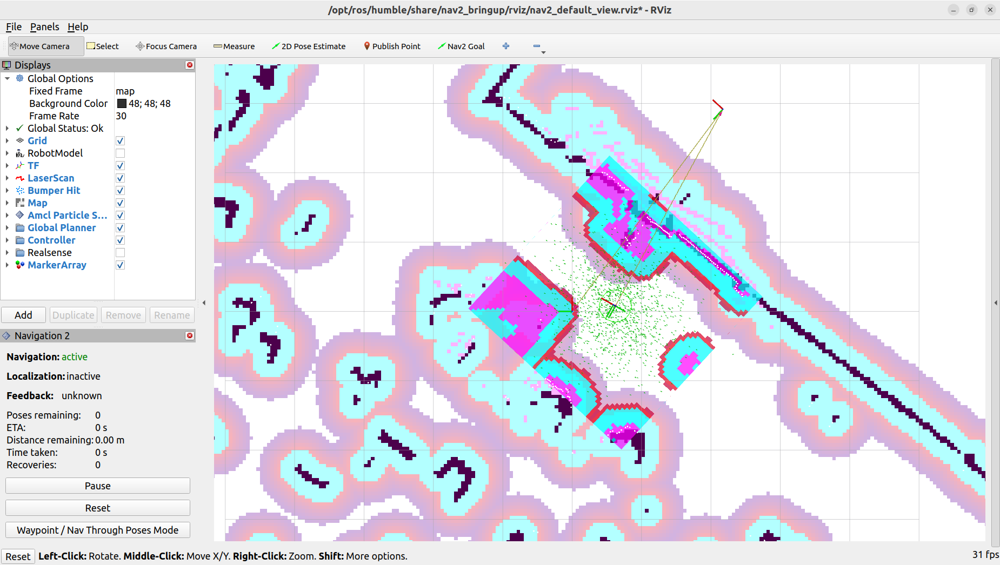
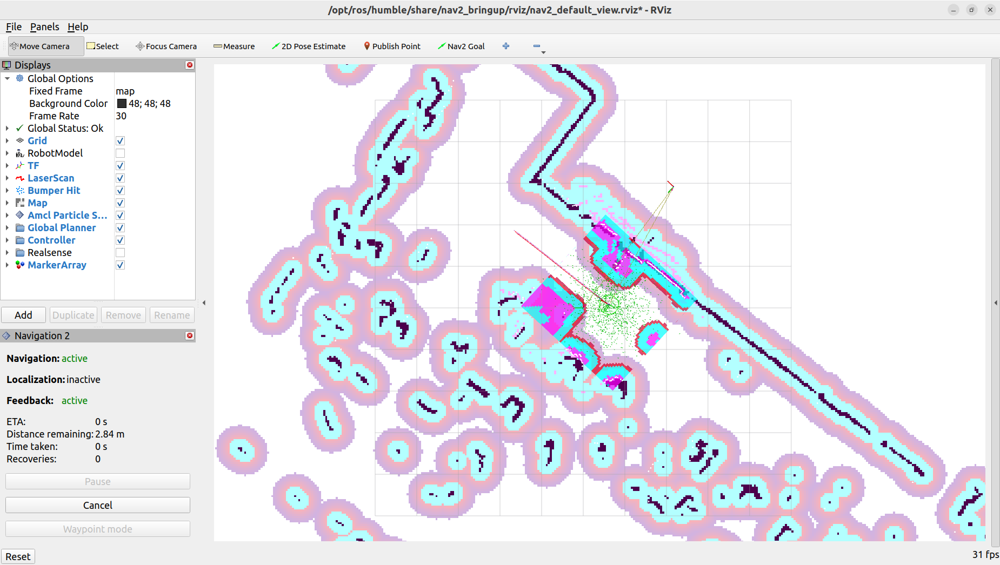
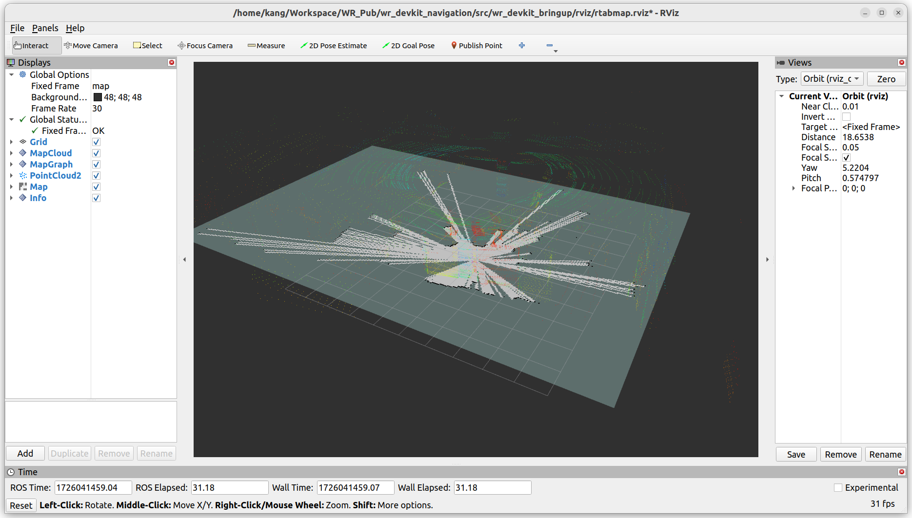
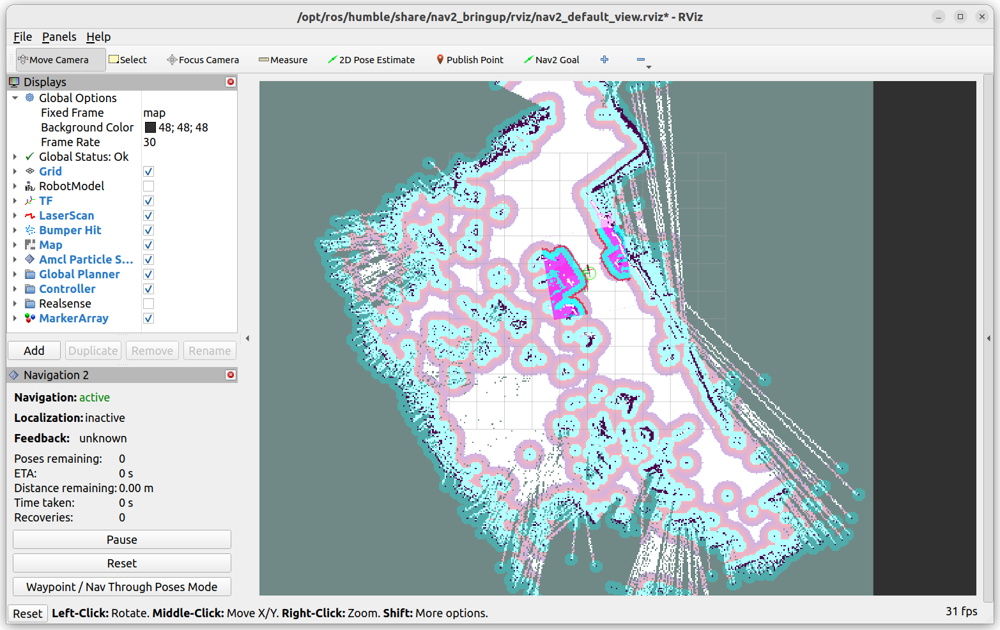
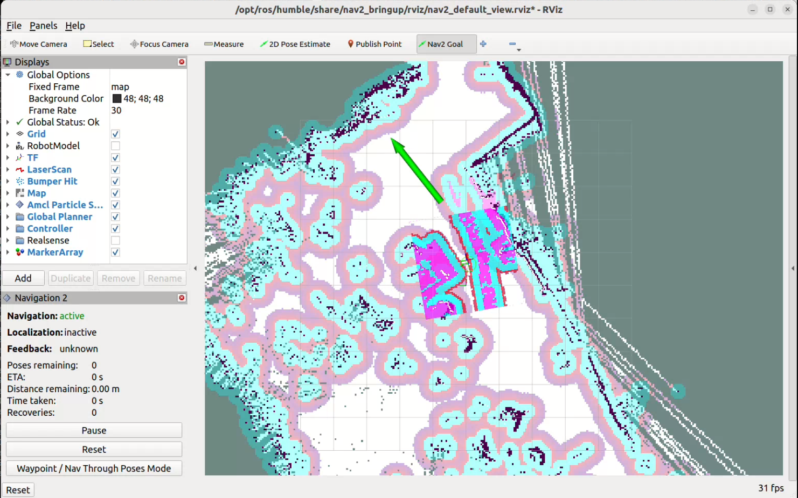

# UGV Devkit Nav2 Sample Setup

## 1. Overview

This guide provides step-by-step instructions for running mapping and navigation samples on the UGV development kit. The kit has been validated by Weston Robot for use with the Scout Mini and Ranger Mini V2 mobile robots. These samples serve as a starting point for developing mobile robots using ROS2. 

### Getting Started

Review the following guide and README files within the `wr_devkit_navigation` package to set up your UGV development kit:

* UGV Devkit Getting Started
* [wr_devkit_navigation](https://github.com/westonrobot/wr_devkit_navigation.git)

### Tutorials

* Tutorial: Cartographer Mapping and Navigation
* Tutorial: RTAB-Map (Real-Time Appearance-Based Mapping) and Navigation

## 2. Cartographer Mapping and Navigation

Cartographer is a system that provides real-time simultaneous localization and mapping (SLAM) in 2D and 3D across multiple platforms and sensor configurations. For autonomous navigation through complex environments, cartographer is integrated with [Nav2 Navigation Stack](https://docs.nav2.org/) by [Open Navigation](https://www.opennav.org/).

You can find more information on [ROS2 Workshop](https://ros2-industrial-workshop.readthedocs.io/en/latest/_source/navigation/ROS2-Cartographer.html) and [cartographer_ros](https://github.com/ros2/cartographer_ros) GitHub repository.

### Mapping

1. Bringup the robot base and sensors. Open a new terminal and enter the command:
    ```bash
    ros2 launch wr_devkit_bringup wr_devkit_platform.launch.py robot_model:=<ROBOT_MODEL>
    ```
  
    | Base                      | `<ROBOT_MODEL>`  |
    |---------------------------|------------------|
    | Ranger Mini 2.0 (default) | ranger_mini_v2   |
    | Scout Mini                | scout_mini       |

    > **Note:** Ensure the argument `robot_model` matches the robot model you are using. Adjust the launch file as necessary to align with your hardware and software setup

2. Launch Cartographer SLAM. In a new terminal, enter the command:
    ```bash
    ros2 launch wr_devkit_bringup wr_devkit_cartographer.launch.py
    ```

3. Open RVIZ2 to view the mapping process:
    ```bash
    rviz2
    ```

    Once RVIZ2 is open, you will see the default display. On the left panel, under the "Displays" section, click on the "Add" button. In the "By display type" tab, scroll down and select "Map" under the "rviz_default_plugins" category. Click "OK" to add the Map display. You should now see the map being visualized in RVIZ2 as the mapping process occurs.

    

    Control the robot around the environement using the remote controller or teleoperation by running `ros2 run teleop_twist_keyboard teleop_twist_keyboard.py`. The speed should be slow throughout the mapping process. If the speed is too fast, the map quality may be affected.

4. After mapping completion, in a new terminal, navigate to the `maps` folder then save the map using `map_server`.
    ```bash
    cd Workspace/wr_devkit_navigation/src/wr_devkit_bringup/maps
    ros2 run nav2_map_server map_saver_cli -f <YOUR_MAP_NAME>
    ```

### Navigation

1. Bringup the robot base and sensors. Open a new terminal and enter the command:
    ```bash
    ros2 launch wr_devkit_bringup wr_devkit_platform.launch.py robot_model:=<ROBOT_MODEL>
    ```

2. Launch Nav2 in a new terminal:
    ```bash
    ros2 launch wr_devkit_bringup wr_devkit_nav2.launch.py robot_param:=<ROBOT_PARAM> map:=<YOUR_MAP_YAML>
    ```

    | Base                      | `<ROBOT_PARAM>`               |
    |---------------------------|-------------------------------|
    | Ranger Mini 2.0 (default) | nav2_ranger_mini.param.yaml   |
    | Scout Mini                | nav2_scout_mini.param.yaml    |

    Ensure the `robot_param` argument matches the robot base you are using. Then, replace `<YOUR_MAP_YAML>` with the absolute path to the map YAML file you saved.

3. Launch RVIZ2 to visualize the navigation process. In a new terminal, enter the command:
    ```bash
    ros2 launch nav2_bringup rviz_launch.py
    ```

    The map to odom frame will not be published until you provide an initial pose estimate. Click on the `2D Pose Estimate` button. Then, on the map, click on the location where the robot is located, and drag the arrow to the direction the robot is facing.
    
    

4. Generally, the laser scan display does not overlap with the map. To correct this, use the `2D Pose Estimate` tool to provide an estimated position for the robot. Repeat this process as necessary until the laser scan display aligns accurately with the map.

    

    
  
5. With an accurate estimation of the robot's location, we can now set a navigation goal for the robot to move toward. Click on the `Nav2 Goal` button, then click on the location on the map where you want the robot to move to, and drag the arrow to set the orientation. The robot should start moving towards the goal.

    

## 3. RTAB-Map and Navigation

> **Note:** RTAB-Map requires an RGB-D camera (e.g. Intel RealSense D435i) for operation. Ensure your camera is properly connected and configured before using RTAB-Map. In this sample mapping, one realsense camera is installed at the front position of the perception layer.

Review the Camera Configuration section in UGV Devkit Getting Started to configure your devkit to launch the camera(s).

### Mapping

1. Bringup the robot base and camera(s). By default, all camera settings are set to 'none'. Based on your setup, only pass in the cameras that are physically connected. Open a new terminal and enter the command:
    ```bash
    ros2 launch wr_devkit_bringup wr_devkit_platform.launch.py robot_model:=<ROBOT_MODEL> <POSITION>_camera:=<CAMERA_TYPE>
    ```

    | `<POSITION>` | `<CAMERA_TYPE>` |        |
    |--------------|-----------------|--------|
    | front        |                 |        |
    | rear         |                 |        |
    | left         | realsense_d435i | rgb_camera |
    | right        |                 |        |

2. Launch RTAB-Map in mapping mode. If you have a monitor connected to the robot PC, you can set argument `rviz` to true to launch RVIZ. Alternatively, you can clone this repository to your computer and load the rviz configuration located at `src/wr_devkit_bringup/rviz/rtabmap.rviz`.
    In a new terminal, enter the command:
    ```bash
    ros2 launch wr_devkit_bringup wr_devkit_rtabmap.launch.py rviz:=<RVIZ_TRUE_FALSE>
    ```

    | `<RVIZ_TRUE_FALSE>` | Description |
    |---------------------|-------------|
    | true                | Launch RVIZ to visualize the mapping process and assess the quality of the map |
    | false               | RVIZ will not be launched, but it can be opened on another PC with the same ROS_DOMAIN_ID |

    

    After building the map, you can exit the program directly. The map will automatically save as `rtabmap.db` in the main directory under `.ros`.

### Navigation

1. Bringup the robot base and camera(s).
    ```bash
    ros2 launch wr_devkit_bringup wr_devkit_platform.launch.py robot_model:=<ROBOT_MODEL> <POSITION>_camera:=<CAMERA_TYPE>
    ```

2. Launch RTAB-Map's localization mode. In a new terminal, enter the command:
    ```bash
    ros2 launch wr_devkit_bringup wr_devkit_rtabmap.launch.py localization:=true
    ```
    
3. Launch nav2
    ```bash
    ros2 launch wr_devkit_bringup wr_devkit_nav2_rtab.launch.py robot_param:=nav2_scout_mini_rtab.param.yaml
    ```

4. Launch RVIZ to visualize the navigation process. 
    
    * Assuming you have a monitor connected to the robot PC, open RVIZ and load the configuration file located at `src/wr_devkit_bringup/rviz/nav2_default_view.rviz`. 
     
      OR

    * If you are working on a different PC, you can launch RVIZ with the following command:
      ```bash
      ros2 launch nav2_bringup rviz_launch.py
      ```

    

    > **Note:** During initialization, the robot may need to detect additional visual features before it can accurately localize itself. To facilitate this, drive the robot around until it appears correctly positioned in RVIZ.

5. To set a navigation goal, click on the `Nav2 Goal` button, then click on the location on the map where you want the robot to move to, and drag the arrow to set the orientation. The robot should start moving towards the goal.

    
