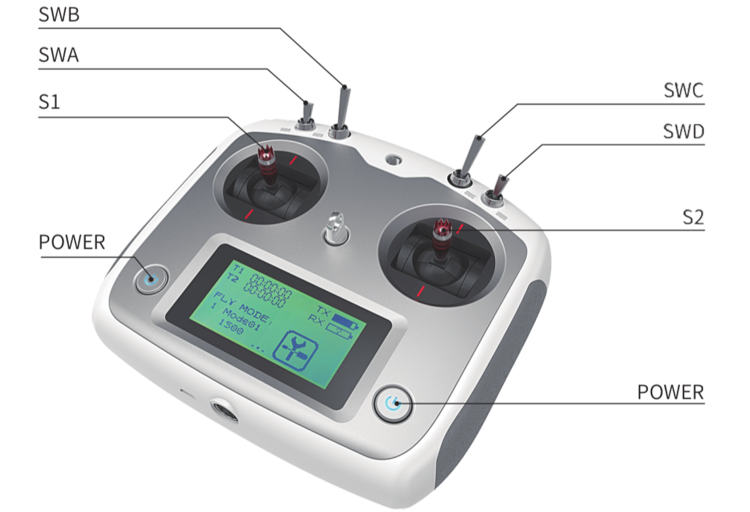
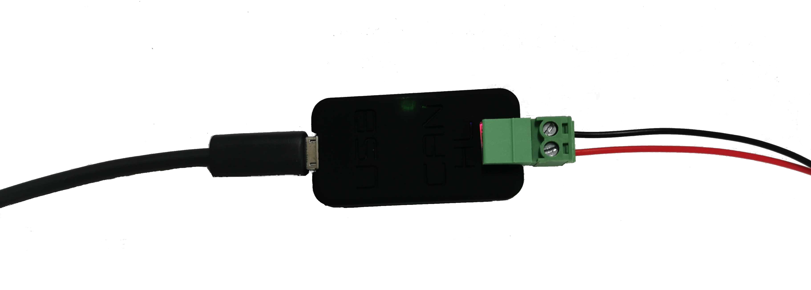

# Robot Base Control

Various mobile robot bases may appear very different but their controls are similar. You may refer to the user guide of a specific robot for all the details. This article aims at providing a general view of the robot control.

## 1. Manual Control

Manual control with a radio transmitter is one of the most common way to control a robot. Even when a robot is designed to be fully autonomous, you may need to manually control the robot for development/debugging purpose. 

Generally, manual control has a higher priority so that you can always take over the control even when the robot is behaving abnormally while executing an autonomous task.

Here is a picture of the remote controller used for most of our mobile bases:



Unless otherwise specified, you can follow the instructions below to control a robot base:

- Keep both **S1** and **S2** sticks at neutral position. Push all switches forward and make sure they're all in the up-most position.
- Press the two **POWER** buttons at the same time for a few seconds, the remote controller will be turned on. (**Note**: You can turn off the controller in the same way.)
- Switch **SWB** to the middle position will enable the robot for manual control.
- Moving **S1** up/down to control the robot to go forward/backward. Moving **S2** left/right to control the robot to turn left/right.
- Switch **SWB** back to its **up** position to disable manual control. In this state, the robot will not respond to the remote transmitter but can be controlled from its other communication interfaces (e.g. CAN bus)
- For some models (e.g. Scout V2.5 and newer), **SWA** acts as a wireless E-Stop. If **SWA** is switched to **down** position, **neither remote controller** **nor CAN interface** would be able to control the robot until **SWA** is returned to **up** position 

## 2. Program Control

If you want to set up the robot for autonomous navigation, you would need to control the robot from your program through some kind of communication interfaces. Most of our robots use CAN bus for this purpose. CAN is reliable and easy to use. But it's not a standard communication interface on most development PCs. So in order to talk with the robot via CAN bus, you would likely need a CAN adapter. You could also use a single-board computer with CAN interface, such as Nvidia Jetson, Raspberry Pi with [CAN HAT](https://www.waveshare.com/wiki/2-CH_CAN_HAT).

**Note**: Nvidia Jetson AGX/NX development kit supports CAN but it only has a CAN controller from the SOC by default. You will need to add a CAN transceiver (e.g. [this transceiver breakout board](https://www.waveshare.com/sn65hvd230-can-board.htm)) to communicate with other CAN devices properly.

### 2.1 Setup CAN Adapter

Here we take the CAN-to-USB adapter shipped with the robot as an example. Setting up drivers for other types of CAN adapters may be a little different. But once the driver is installed properly, subsequent CAN operations are the same in Linux.



1. Enable gs_usb kernel module

```bash
sudo modprobe gs_usb
```

2. Plug the USB port of the adapter to your computer, bringup can device

```bash
sudo ip link set can0 up type can bitrate 500000
sudo ip link set can0 txqueuelen 1000
```

Now you should be able to see the can0 interface. Type "ifconfig" command in a terminal, look for "can0" and you should see something similar:

```bash
can0: flags=193<UP,RUNNING,NOARP>  mtu 16
    unspec 00-00-00-00-00-00-00-00-00-00-00-00-00-00-00-00  txqueuelen 1000  (UNSPEC)
    RX packets 4  bytes 32 (32.0 B)
    RX errors 0  dropped 0  overruns 0  frame 0
    TX packets 4  bytes 32 (32.0 B)
    TX errors 1  dropped 1 overruns 0  carrier 1  collisions 0
```

### 2.2 Check Frames on CAN Bus

You can easily check CAN bus traffic with can-utils in Linux.

```bash
sudo apt-get install can-utils
```

The most commonly used commands from can-utils are "candump" and "cansend".

#### Listen to CAN frames on the bus

In the following example, you will see can frames on can0 printed out to the terminal.

```bash
candump can0
```

If you're looking for frames with a specific CAN ID, you can apply a filter. For example, to look for CAN frames with ID 0x602, you can use

```bash
candump can0,602:1fffffff
```

#### Send a CAN frame to the bus

You can also send a frame to the CAN bus. For example, send frame with data "0x00 0x11 0x22 0x33 0x44 0x55 0x66 0x77" with ID 0x121 to can0 interface. 

```bash
cansend can0 121#0011223344556677
```

**Note**: You can send up-to 8 bytes in a single CAN frame.

#### Log Frames and Playback

You can log can frames from a CAN interface to a file for debugging.

```bash
candump -l can0
```

Then you can playback the log file

```bash
canplayer -I <candump-log-file-name>.log
```

### 2.3 Control the Robot with SDK/ROS

Now you've setup the CAN interface on your development or onboard computer. Connecting the robot CAN to your computer CAN (HIGH signal to High, LOW signal to LOW). Make sure **SWB** on the remote controller is at the up position. Now you should be able to use the SDK or ROS node to control the robot. 

Refer to [sample code](https://github.com/westonrobot/wrp_sdk/tree/sample-v1.0.0/sample/mobile_base) and [sample launch files](https://github.com/westonrobot/wrp_ros/tree/main/launch/mobile_base) for details of the program control.

**Important**: Please lift the robot up with a stool and keep the RC controller in hand for the initial testings to avoid the robot crashing into something around. 
