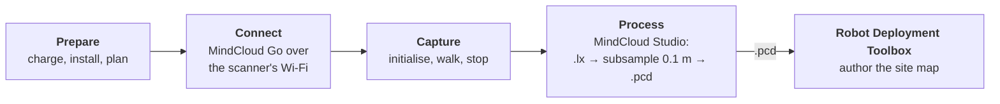

# Manifold Scanner Guides

These guides cover capturing a site with a [Manifold Pocket2 Scanner](/peripheral/sensor/manifold_pocket2) and exporting the point cloud a robot deployment is built on.

What to know before your first session:

- **It records to its own internal SSD.** The capture is on the scanner, not on the phone.
- **The phone connects over the scanner's own Wi-Fi**, and is used to start, preview and stop the scan.
- **While joined to that Wi-Fi the phone has no internet**, and only one phone can be connected at a time.
- **A scan is not finished when you stop walking.** It has to be stopped in the app and saved.

## From a scan to a site map

A scan is not a map. It records where surfaces are, but not where a robot may drive, what is off limits, or which places matter. Adding that is the [Robot Deployment Toolbox](/solution/robot-deployment-toolbox)'s job, and the two meet at a single file.

These guides take you as far as the `.pcd`. From there, [Map editor](/solution/robot-deployment-toolbox/map-editor) loads it in its Load stage and carries it through to a published map.

## The workflow end to end

If you are doing this for the first time, read the guides in this order rather than dipping in.

| | Step | Covered in |
| --- | --- | --- |
| 1 | Charge the scanner, install both applications, plan the session | [Getting started](/peripheral/sensor/manifold_pocket2#getting-started) on the product page |
| 2 | Join the phone to the scanner's own Wi-Fi | [Connection](./connecting.md#joining-the-scanners-network) |
| 3 | Turn on **Connect Device** and check the sensor indicators | [Connection](./connecting.md#connecting-the-app-to-the-scanner) |
| 4 | **Start Scan**, name the project, decide the NTRIP and Panorama toggles | [Scanning](./scanning.md#creating-the-project) |
| 5 | Initialise on a flat, level surface — hands off until the point cloud appears | [Scanning](./scanning.md#initialisation) |
| 6 | Walk the site: controlled pace, loops, gentle tilts for corners | [Scanning](./scanning.md#walking-the-site) |
| 7 | Stop, and wait for the project to save | [Scanning](./scanning.md#stopping-is-the-step-that-commits-the-data) |
| 8 | Connect rear **Port C** to a computer and copy the whole project folder | [Processing](./processing.md#getting-the-capture-from-the-scanner) |
| 9 | **File ▸ New Task**, browse to the `.lx`, choose the optimisations | [Processing](./processing.md#loading-it-in-mindcloud-studio) |
| 10 | Look at the result before committing to it | [Processing](./processing.md#look-at-it-before-you-export) |
| 11 | **Subsample ▸ Spatial ▸ 0.1 m** | [Processing](./processing.md#subsampling-to-01-m) |
| 12 | Export **Point Cloud Library cloud (`*.pcd`)**, **Binary**, as `pointcloud_map.pcd` — aim for under about 300 MB | [Processing](./processing.md#exporting-the-pcd) |
| 13 | Import the `.pcd`, set up levels and author the site map | [Robot Deployment Toolbox](/solution/robot-deployment-toolbox/map-editor) |
| 14 | Deploy, and check the robot actually localises and navigates | [The final check is the robot](./processing.md#the-final-check-is-the-robot-not-the-file) |

**Step 14 is the one that decides whether the rest worked.** Every check before it — a clean-looking cloud, a `.pcd` the toolbox accepts, levels that extract, a map that validates — tells you the files are coherent, not that a robot will drive on them.

## The guides

| Guide | Reach for it when |
| --- | --- |
| [Pocket2 Connection Guide](./connecting.md) | Setting the app up for the first time, or the app cannot see the scanner |
| [Pocket2 Scanning Guide](./scanning.md) | Your first session, or a capture came back with gaps |
| [Point Cloud Processing & Export Guide](./processing.md) | You have a raw capture and need a usable point cloud |

**[All scanning guides](/tutorial/tags/scanning)** — generated from the `scanning` tag, so anything published later appears there without this page being edited.

## What you need

| | |
| --- | --- |
| **Scanner** | A [Pocket2](/peripheral/sensor/manifold_pocket2) with a charged handle battery — up to 2 hours of capture |
| **Phone or tablet** | Running **MindCloud Go**, on Android or iOS |
| **Desktop computer** | Running **MindCloud Studio** — Windows, or Linux as an AppImage. It requires a **per-machine licence**, so sort that out before the site visit rather than on it: request one from Manifold, or [from us](/support/before-you-contact-us) if you bought the scanner through Weston Robot. [Loading and processing a capture](./processing.md#loading-it-in-mindcloud-studio) is slow and CPU-heavy, so run it on a machine you can leave busy |
| **USB-C data cable** | USB 3.0, for copying projects from the scanner. The supplied cable, or a known data cable — a charge-only one will not enumerate the SSD |

MindCloud Studio works with all of Manifold Tech's scanners, so the processing guide applies equally to a capture from the earlier [Pocket Scanner](/peripheral/sensor/manifold_pocket). The connection and scanning guides describe the Pocket2's app screens.

## Resources

| Resource | What it is | Where |
| --- | --- | --- |
| Pocket2 downloads and resources | Manifold's maintained page for the **current Pocket2 User Manual** — the authority for the scanner and the field app — and related software | [Downloads page](https://www.3dmanifold.com/download) |
| MindCloud Studio | The desktop application — **Windows**, and **Linux as an AppImage**. The same page carries its user manual, the authority for processing and export | [Download page](https://version.manifoldtech.cn/download/mcs?lang=en) |
| MindCloud Go | The field app | [App Store](https://apps.apple.com/us/app/mindcloud-go/id6670299069) · [Google Play](https://play.google.com/store/apps/details?id=com.mindcloudgo.go) |
| Manifold Tech support | The manufacturer's contact page — **after-sales support**, plus a contact form | [Contact & support](https://www.3dmanifold.com/cooperate) |

Manifold's support address is `contact@3dmanifold.com`.

---

Once you have a `.pcd`, continue with the [Robot Deployment Toolbox](/solution/robot-deployment-toolbox). Something wrong with the scanner itself? [Manifold Pocket2 Scanner › Troubleshooting](/peripheral/sensor/manifold_pocket2#troubleshooting--faq) first, then [Support](/support/before-you-contact-us).
