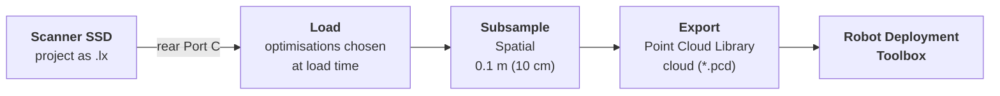

# Point Cloud Processing & Export Guide

The scanner writes its own format. **MindCloud Studio is the only thing that reads it**, and the [Robot Deployment Toolbox](/solution/robot-deployment-toolbox) reads a different one again, so this guide is the bridge: `.lx` off the device, through MindCloud Studio, out as a `.pcd`.

You need **MindCloud Studio**, available for **Windows** and for **Linux as an AppImage** from [Manifold's download page](https://version.manifoldtech.cn/download/mcs?lang=en), which is also where its user manual lives. It requires a **per-machine licence** — you can request one from Manifold directly, or contact us if you bought the scanner through Weston Robot.

:::note Which versions this describes

These instructions are based on **MindCloud Studio v1.6.10 on Windows** and **v1.2.10 on
Linux**, and the interface differs between them and in other releases. Work from the
control names rather than the screenshots; if something has moved, trust your screen.

:::

## Getting the capture from the scanner

Power the scanner **on**, then connect **Port C — on the rear of the unit** — to the computer with a USB-C cable. The internal SSD appears as storage. **Copy the whole project folder** — the `.lx` inside it is not enough on its own.

Port C is the connector beside the hot shoe and the battery indicators, and it carries **data as well as charging**. The separate **DATA** port on the front does the same job — either works. This guide uses Port C, which is the one photographed; [Electrical interfaces](/peripheral/sensor/manifold_pocket2#electrical-interfaces) on the product page describes both.

Three things go wrong here:

- **The scanner must be on.** It is not a passive drive.
- **The cable must be a USB 3.0 data cable.** A charge-only cable gives no device at all, which reads as a broken scanner.
- **Both ends need to be fully seated.**

:::note What `.lx` actually is

`.lx` (with `.olx`) is Manifold Tech's own format, written by the scanner and read only
by MindCloud Studio. You do not export it — it is what a capture *is* until you convert
it, and it keeps whatever name the scanner gave it. The folder is the unit — copy and
keep all of it, because everything downstream, including the `.pcd`, is derived from it
and can be regenerated from it.

:::

## Loading it in MindCloud Studio

Loading the `.lx` is where the processing happens, so the options in this dialog shape everything after it.

1. Start MindCloud Studio.
2. **File**.
3. **New Task**.
4. At **Project Path**, **Browse** to the folder you copied from the scanner and select the **`.lx`** file.
5. Choose the **Optimization Options** (below).
6. **OK**.

:::warning Loading and processing the `.lx` is the slow step

**A 2 GB capture can take 30 minutes or more**, and the machine's **CPU is busy
throughout** — so start it when you do not need that machine for anything else, and read
a long wait as work in progress rather than a hung application.

:::

<Figure
  src={require('./img/mindcloud-studio-import-lx.png').default}
  alt="MindCloud Studio with the File menu, the New Task button and the New Project dialog annotated in sequence; the dialog shows Project Path with a Browse button pointing at an .lx file, an auto-filled Project Name, Optimization Options with Loop Closure, Bundle Adjustment and Moving Object Filtering all ticked, and an Advanced Settings group with Resolution set to 0"
  size="full"
  framed
  caption="File ▸ New Task, then Browse to the .lx. The Project Name is filled in from the package's date-and-time identifier. Click to enlarge." />

**The optimisations are applied during that processing, not afterwards** — so this is the one dialog you cannot come back to.

| Optimisation | What it does | Baseline |
| --- | --- | --- |
| **Loop Closure** | Recognises areas the scanner revisited and uses them to correct accumulated trajectory drift, improving how well the whole map aligns | **On.** It is what the loops you walked were for |
| **Moving Object Filtering** | Reduces points left by things that moved during the capture — people, traffic, a passing cart | **On.** It targets transient objects, not every feature that is not a wall, and it will not leave a perfectly clean cloud |
| **Bundle Adjustment** | Distributes small local errors across the scene instead of letting them pile up at the edges, which reduces noise and layering — a wall crossed twice comes out as one surface rather than two slightly offset ones | **On.** Note that *thinner* here means crisper surfaces, not fewer points: nothing is discarded |

**All three were enabled on the capture these guides follow** — that is the state in the dialog above — with **Advanced Settings** left at their defaults. Treat that as the starting point rather than a requirement: a capture with no revisited areas gains nothing from Loop Closure, and an empty building gains nothing from Moving Object Filtering.

:::tip Aim for the site as the robot will find it, not the cleanest cloud

A robot localises by matching what it sees against the map, so the map wants **the
persistent structure of the real environment**: walls, corners, columns, fixed racking and
equipment that will still be there next month. Those are what tell one place from another.

The things worth losing are **transient** — people, vehicles, a cart parked for an
afternoon, anything that will not be present in normal operation. That is what Moving
Object Filtering is for, and the distinction is transient versus persistent rather than
clutter versus walls.

It follows that a map can be *too* clean. Strip out every secondary but permanent feature
in a repetitive building — identical corridors, repeated bays, uniform walls — and you
remove the very detail that made one stretch distinguishable from the next. Keep real
structure; drop what was only passing through.

:::

Among those Advanced Settings is a **Resolution (0 for original)** field, in **millimetres**. It is a load-time density and **not** the subsampling step below. Leave it alone.

**If the capture was split into segments**, they are stitched in MindCloud Studio rather than loaded one at a time — **Multi-flight Stitching**, documented in its manual. It relies on each segment beginning where the previous one ended, which is why the seams have to be planned on site rather than chosen when the battery runs low. The same optimisation options apply to the stitched result.

Once it is open, MindCloud Studio also has **RTK Optimization**, a coordinate-accuracy pass for RTK captures. It is documented in the manual.

## Subsampling to 0.1 m

This step decides how heavy the file you hand the toolbox is.

:::tip Aim for a `.pcd` under about 300 MB

That file does not stay on your laptop. It is uploaded to the Robot Management Toolbox and then pushed down to
every robot that works the site, all of it over Wi-Fi — so its size is a cost paid again on
every upload and every deployment, by people who were not there when it was exported.

**Denser is not better.** Past the point where the permanent structure of the building is
legible, extra points buy nothing: the robot localises against walls, columns and fixed
racking, not against how many returns landed on them. A cloud can also be
[too sparse](/solution/robot-deployment-toolbox/map-editor#1--load-map-data) to localise
against, so this is a band to land in rather than a number to drive down.

:::

**Select the cloud, not the project.** In the DB tree the loaded `.lx` appears as a parent with children under it — a **`…-Cloud`** entry and a `Trajectory`. Pick the `…-Cloud`. Then, on the **Tools** tab, click **Subsample** in the **Processing** group.

<Figure
  src={require('./img/mindcloud-studio-spatial-subsampling.png').default}
  alt="MindCloud Studio with the -Cloud entry selected in the DB tree and the Subsample toolbar button annotated; the Cloud sub sampling dialog shows method set to Spatial, a large-to-small slider, and min. space between points set to 0.1000. The properties panel reports 28,581,173 points"
  size="full"
  framed
  caption="The -Cloud child selected, and Subsample on the Tools tab. The properties panel on the left reports what you are about to reduce — here 28,581,173 points. Click to enlarge." />

The **Cloud sub sampling** dialog asks for a `method`:

| Method | What it does |
| --- | --- |
| `Random` | Keeps a fixed number of points, chosen at random |
| `Random (%)` | Keeps a percentage of points, chosen at random |
| **`Spatial`** | Keeps points no closer together than a given distance. **The unit is metres** |
| `Octree` | Reduces by subdividing space to a chosen depth |

**Choose `Spatial`, and set `min. space between points` to `0.1`** — that is **0.1 m, or 10 cm**, because the field is in metres. Dense enough to place nodes, segments and zones against a building, and light enough to load and draw on quickly.

On the build above, `Spatial` and `0.1000` are already what the dialog offers, so this is usually a matter of confirming the values rather than typing them. Check them anyway.

Spatial is the right method here rather than either random option because the requirement is a *uniform* density: random sampling thins a densely scanned wall and a sparsely scanned one by the same proportion, which leaves the sparse one unusable. Spatial gives every part of the site the same point spacing regardless of how long you stood in front of it.

**The result is a new cloud, not a modified one.** A `…-Cloud.subsampled` entry appears in the DB tree alongside the original, and that is the one you export. On the capture shown above the reduction was **28,581,173 points down to 59,748** — which is the whole argument for doing this before the handoff rather than after it.

:::tip Reduce here, not in the toolbox

The Robot Deployment Toolbox has its own **Downsample** in its Prepare Data stage, which
does much the same job — but it only runs *after* the `.pcd` is imported, so relying on
it means moving and loading a file several times larger than it needs to be.

Reduce here, and the file is the right size before anyone opens it. The toolbox's control
stays useful for a cloud you were handed that is still too heavy.

:::

## Look at it before you export

You now have the cloud that will become a site map, and this is the cheapest moment to notice that it should not be. Rotate it, look down on it, and look along the walls:

- the cloud looks **tilted** — the floor is not level in the view;
- geometry looks **warped or distorted** — walls bowed, right angles that are not;
- **doubled or ghosted geometry**, the same surface appearing twice slightly apart;
- **major misalignment** — a corridor that bends where the building is straight, or a loop that visibly fails to close;
- **sections detached or clearly displaced** from the rest;
- **missing coverage** where you thought you had walked;
- **transient artefacts** — smears left by people or vehicles that filtering did not catch.

Then one question the list above will not answer: **does the cloud still hold enough permanent structure to tell one part of the site from another?** A repetitive building that has been filtered hard can come out looking tidy and be harder to localise in than the messier version. If whole stretches now look interchangeable, that is worth a second look before export.

**A cloud showing any of these clearly should not be accepted just because it can be exported.** Reprocess with different optimisations if that is plausible, and otherwise re-scan. A poor cloud does not improve downstream — it becomes a site map that looks reasonable in the editor and navigates badly, and by then the mistake has everything else built on top of it.

:::caution Visual inspection is a screening step, not a proof

It reliably catches a map that is obviously tilted, warped, doubled, disconnected or
badly misaligned. It cannot tell you that a clean-looking cloud is geometrically
accurate, and it **cannot tell you a robot will navigate on it**. Where accuracy itself
matters, that is what RTK is for; where navigation matters,
the answer only comes from
[deployment](#the-final-check-is-the-robot-not-the-file).

:::

## Exporting the `.pcd`

Select the **`…-Cloud.subsampled`** entry, then use the save action — the disk icon in the toolbar at the top left, or **File ▸ Export**. Set **Files of type** to:

> **Point Cloud Library cloud (`*.pcd`)**

<Figure
  src={require('./img/mindcloud-studio-export-pcd.png').default}
  alt="MindCloud Studio with the subsampled cloud selected in the DB tree, the save icon annotated in the top toolbar, and a Save file dialog whose File name field and Files of type set to Point Cloud Library cloud (*.pcd) are annotated. The properties panel reports 59,748 points"
  size="full"
  framed
  caption="Exporting the subsampled cloud — 59,748 points here, against the 28.5 million it came from. Click to enlarge." />

**Then choose the encoding.** A **PCD output format** dialog offers three:

<Figure
  src={require('./img/mindcloud-studio-export-pcd-format.png').default}
  alt="The PCD output format dialog offering Compressed binary, Binary and ASCII/text, with Binary selected, above a warning that filenames containing local characters such as Chinese paths may not be handled correctly"
  size="md"
  framed
  caption="Pick Binary." />

| Option | Use it? |
| --- | --- |
| **Binary** | **Yes — the baseline.** Compact and quick to load |
| Compressed binary | **Not used here.** Binary is the encoding this workflow has been run with |
| ASCII/text | **It works**, and it is human-readable — but the file is substantially larger for no gain the toolbox can use, which counts against the size target above |

Confirm with **Yes**, then **check the size of the file you just wrote** against the 300 MB target above. If it is well over, keep reducing in Studio rather than handing it on. The **SOR (Statistical Outlier Removal) filter** clears scattered noise; if your build does not offer it, **cropping** alone will take you a long way — it removes what the map does not need at all, such as ground beyond the building, a neighbouring unit, or a car park that is not part of the site.

:::caution Save it as `pointcloud_map.pcd`

Name the exported cloud **`pointcloud_map.pcd`**, so that anyone opening a site's files
later knows which cloud the map was drawn against.

:::

The Robot Deployment Toolbox accepts `PCD`, `PLY`, `XYZ` or `PTS`, and carries colour if the scan has it, so `PLY` loads too. `PCD` is the baseline.

## Next: the Robot Deployment Toolbox

You now have the file the deployment workflow starts from — a point cloud at 10 cm spacing, in a format the toolbox reads. A `.pcd` is still just points: where the floor is, where a robot may drive, and which places matter are all added in the next tool.

**Continue with [Map editor](/solution/robot-deployment-toolbox/map-editor).** Its **Load** stage takes the `.pcd` under *Start from local files*, and from there five stages carry it to a published map. Two of them overlap with what you have just done, so you need not repeat either:

- **Gravity align** in its Prepare stage levels a scan whose floor is not flat. Worth knowing about, because a subtly tilted scan produces a map that looks right and navigates badly.
- **Crop** removes the parts of the site the map does not cover. Easier there, against the occupancy map, than here.

### The final check is the robot, not the file

Each step below is easy to mistake for the one after it:

| Step | What passing it tells you |
| --- | --- |
| Visual inspection of the cloud | It is not *obviously* broken |
| A `.pcd` the toolbox accepts | The file is readable, and nothing more |
| Levels extracted from it | There is enough structure for the tool to find a floor |
| A level defined by hand | The workflow can continue — **not** that the cloud is good |
| A finished, published map | Someone has described the site. Whether correctly is still open |

**The validation that counts is deployment.** If the robot cannot localise and navigate reliably on the resulting map, the scan and the map preparation need revisiting — even when the point cloud looked acceptable in the editor and every step above passed. None of these steps is a substitute for that, and a map can clear all of them and still be unsuitable in the building.

---

Back to the [Manifold Scanner Guides](./index.md) overview, or on to the [Robot Deployment Toolbox](/solution/robot-deployment-toolbox).
