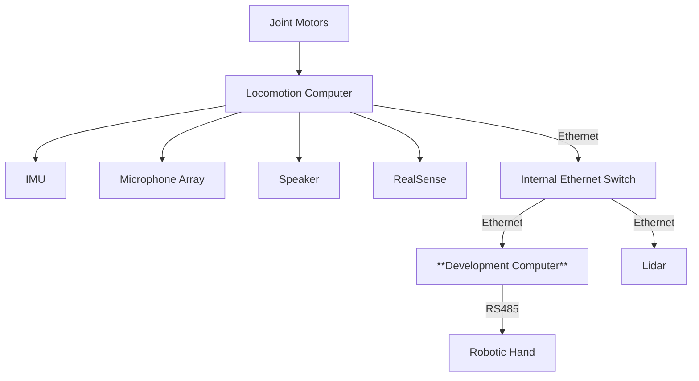
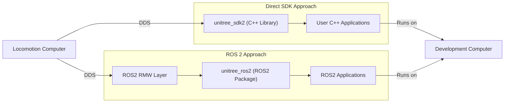
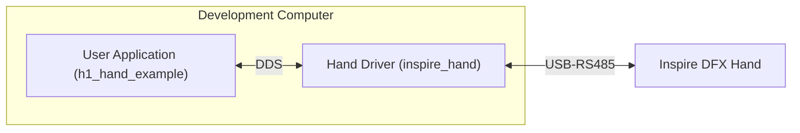
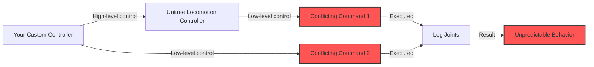

import G1_EDU_IMG from './img/g1_joints.png';
import G1_EDU_ZERO_JOINT_IMG from './img/zero_joint_state.png';
import G1_WAIST_JOINT_IMG from './img/waist_joint_control.png';
import G1_ANKLE_JOINT_IMG from './img/ankle_joint_control.jpg';
import INSPIRE_DFX_IMG from './img/inspire_dfx_hand.png';
import INSPIRE_FTP_IMG from './img/inspire_ftp_hand.png';
import DEX3_1_IMG from './img/dex3_1_hand.png';
import LIVOX_AND_REALSENSE_IMG from './img/livox_and_realsense.png';
import DEV_PC_HW_IF_IMG from './img/dev_pc_hw_interface.jpg';
import DEBUG_MODE1_IMG from './img/debug_mode_1.jpg';
import DEBUG_MODE2_IMG from './img/debug_mode_2.jpg';

# G1 Development Guide

This guide is designed to help you get started with the **G1 EDU** humanoid robot development. It covers the hardware and software components, as well as the development process. This guide is not intended to replace the [official Unitree documentation](https://support.unitree.com/home/en/G1_developer), but rather to provide a complementary perspective on key information and walk you through the most important development steps.

## 1. Get to Know G1 Hardware

### 1.1 Joint Configuration

To start working with any articulated robot, it is essential to know its number of degrees of freedom (DOF) and the joint configuration. The following image shows the joint configuration of the G1 robot:

    

The indexes, names and limits of all the G1 joints are given in the table below. The **29 joints** of the main body are divided into 3 groups: legs, waist and arms. The legs have 6 joints each, the waist has 3 joints and each arm has 7 joints. Note that the motor specifications for the different joints are not the same. The knee joint is equipped with the most powerful motor, which is capable of delivering a maximum torque of 120 Nm.

  

    | Joint Index | Joint Name        | limit(rad)               |
    | ----------- | ----------------- | ------------------------ |
    | 0           | L_LEG_HIP_PITCH   | -2.5307~2.8798           |
    | 1           | L_LEG_HIP_ROLL    | -0.5236~2.9671           |
    | 2           | L_LEG_HIP_YAW     | -2.7576~2.7576           |
    | 3           | L_LEG_KNEE        | -0.087267~2.8798         |
    | 4           | L_LEG_ANKLE_PITCH | -0.87267~0.5236          |
    | 5           | L_LEG_ANKLE_ROLL  | -0.2618~0.2618           |
    | 6           | R_LEG_HIP_PITCH   | -2.5307~2.8798           |
    | 7           | R_LEG_HIP_ROLL    | -2.9671~0.5236           |
    | 8           | R_LEG_HIP_YAW     | -2.7576~2.7576           |
    | 9           | R_LEG_KNEE        | -0.087267~2.8798         |
    | 10          | R_LEG_ANKLE_PITCH | -0.87267~0.5236          |
    | 11          | R_LEG_ANKLE_ROLL  | -0.2618~0.2618           |
    | 12          | WAIST_YAW         | -2.618~2.618             |
    | 13          | WAIST_ROLL        | -0.52~0.52               |
    | 14          | WAIST_PITCH       | -0.52~0.52               |
    | 15          | L_SHOULDER_PITCH  | -3.0892~2.6704           |
    | 16          | L_SHOULDER_ROLL   | -1.5882~2.2515           |
    | 17          | L_SHOULDER_YAW    | -2.618~2.618             |
    | 18          | L_ELBOW           | -1.0472~2.0944           |
    | 19          | L_WRIST_ROLL      | -1.972222054~1.972222054 |
    | 20          | L_WRIST_PITCH     | -1.614429558~1.614429558 |
    | 21          | L_WRIST_YAW       | -1.614429558~1.614429558 |
    | 22          | R_SHOULDER_PITCH  | -3.0892~2.6704           |
    | 23          | R_SHOULDER_ROLL   | -2.2515~1.5882           |
    | 24          | R_SHOULDER_YAW    | -2.618~2.618             |
    | 25          | R_ELBOW           | -1.0472~2.0944           |
    | 26          | R_WRIST_ROLL      | -1.972222054~1.972222054 |
    | 27          | R_WRIST_PITCH     | -1.614429558~1.614429558 |
    | 28          | R_WRIST_YAW       | -1.614429558~1.614429558 |
  

  

    
  

You don't need to memorize all joint names and limits, but you should become familiar with the robot's joint configuration. We recommend physically interacting with the powered-off robot and manually rotating each joint to develop better intuition. Understanding the joint configuration is crucial for comprehending the robot's kinematics and dynamics, as well as for programming movements effectively. You'll likely need to reference this table when configuring the URDF model and implementing joint-level control systems.

There are two special joints you may need to pay attention to:

1. The **waist** joint. If the G1 model you get has 3-DOF waist joints, you can optionally lock the roll and pitch joints to create a 1-DOF waist joint. This is useful for some applications where you only need to control the yaw joint. Please refer to Unitree documentation for more information on [how to lock the waist joint](https://support.unitree.com/home/en/G1_developer/waist_fastener). Note that this process requires **both hardware modification** and **software configuration.**
1. The **ankle** joint. The ankle joint adopts a parallel mechanism design. It provides two control modes:
   * **PR Mode**: Controls the Pitch (P) and Roll (R) motors of the ankle joint (default mode, corresponding to the URDF model).
   * **AB Mode**: Directly controls the A and B motors of the ankle joint (requires users to calculate the parallel mechanism kinematics themselves).
   You can read more about this mechanism from this [Unitree documentation page](https://support.unitree.com/home/en/G1_developer/basic_motion_routine).

    

        
        
<em>Lock 3-DOF waist joint</em>

    

    

        
        
<em>Ankle joint parallel mechanism</em>

    

:::warning Safety Warning

Improper modification or control of the robot joints can lead to serious damage to the robot's hardware or potentially cause injury to operators. Before attempting any joint movement programming or physical interaction with the robot:

1. Thoroughly understand the joint limits and mechanical constraints
2. Start with slow movements and low torques when testing new control algorithms
3. Always have an emergency stop **procedure** ready
4. Ensure proper clearance around the robot during operation

If you're uncertain about any aspect of joint operation or control, please reach out to [Weston Robot Support](https://forms.office.com/r/UXzrrsgEyW) for assistance before proceeding.

:::

### 1.2 Main Peripherals

Besides the main body, the G1 robot is equipped with several peripherals that enhance its capabilities. The following table summarizes the main peripherals and their functions:

| Peripheral Name | Function                                                                    |
| --------------- | --------------------------------------------------------------------------- |
| Robotic Hand    | Dexterous hand (compatible models include Dex3-1, Inspire FTP, Inspire DFX) |
| 3D LIDAR        | Livox Mid-360 for obstacle detection and mapping                            |
| RGB-D Camera    | RealSense D435i for visual perception and object recognition                |

The Livox Mid-360 Lidar and RealSense D435i camera are mounted on the robot's head. The following image shows the G1 robot with the Livox and RealSense mounted on its head:

    

You can use the table below to find out the specific model of the robotic hand you have. The Inspire FTP and Inspire DFX hands look similar. The main difference is that the Inspire FTP model support tactile sensing, while the Inspire DFX model does not. The Dex3-1 hand has only 3 fingers, thus it is easy to distinguish from the other two models. 

| Robotic Hand Model | Picture                                                                      | Link                                                                                |
| ------------------ | ---------------------------------------------------------------------------- | ----------------------------------------------------------------------------------- |
| Dex3-1             |            | [Link](https://support.unitree.com/home/en/G1_developer/dexterous_hand)             |
| Inspire FTP        |  | [Link](https://support.unitree.com/home/en/G1_developer/inspire_ftp_dexterity_hand) |
| Inspire DFX        |  | [Link](https://support.unitree.com/home/en/G1_developer/inspire_dfx_dexterous_hand) |

Note that G1 also includes built-in IMU, microphone array and speaker. You can refer to the Unitree documentation for more information on how to interact with these components. 

### 1.3 Electrical Connectivity
The electrical connectivity of the G1 robot follows a hierarchical architecture as illustrated below. The locomotion computer and its connected components function as a closed system that users cannot directly access. Think of this as a black box with protected internals. Nevertheless, you can still utilize these components' capabilities through the provided SDK. The development computer serves as your primary gateway for programming and controlling the robot.

* **Locomotion computer** is referred as **operation and control computing unit** in the Unitree documentation. It communicates with the motor drivers and other low-level devices inside the robot directly. Unitree locomotion controller runs on this computer. This computer is not accessible to users.
* **Development computer** is referred as **development computing unit** in the Unitree documentation. User can use this computer to run their own code. Both low-level (joint control) and high-level (speed control with the robot as a mobile base) code can run on this computer. 

:::info Note
The development computer features an **Nvidia Jetson Orin NX** module installed on a custom Unitree carrier board. This requires a specific BSP (Board Support Package) for proper driver support and device tree configurations. Do not attempt to flash the Orin NX module with any third-party images, as this could render the system inoperable.
:::

The carrier board provides the following interfaces:

    

| No. | Connector Name | Interface Description | Interface specification                                           |
| --- | -------------- | --------------------- | ----------------------------------------------------------------- |
| 1   | XT30UPB-F      | VBAT                  | 58V/5A Battery power output (directly connected to battery power) |
| 2   | XT30UPB-F      | 24V                   | 24V/5A power output                                               |
| 3   | XT30UPB-F      | 12V                   | 12V/5A power output                                               |
| 4   | RJ45           | 1000 BASE-T           | GbE (gigabit Ethernet)                                            |
| 5   | RJ45           | 1000 BASE-T           | GbE (gigabit Ethernet)                                            |
| 6   | Type-C         | Type-C                | Support USB3.0 host, 5V/1.5A power output                         |
| 7   | Type-C         | Type-C                | Support USB3.0 host, 5V/1.5A power output                         |
| 8   | Type-C         | Type-C                | Support USB3.0 host, 5V/1.5A power output                         |
| 9   | Type-C         | Alt Mode Type-C       | Supports USB3.2 host and DP1.4                                    |
| 10  | 5577           | I/O OUT               | 12V: 12V/3A power output                                          |

The [Electrical Interface section](https://support.unitree.com/home/en/G1_developer/about_G1) from Unitree documentation provides additional information. But the above information should be sufficient for you to get started. Notablly, you need to know the following key points:

* You can directly access the development computer by connecting a Type-C to HDMI adapter to port [9] (adapter not included, requires separate purchase). This allows you to connect a monitor and keyboard to the development computer.
* The recommended method for accessing the development computer is connecting an external computer (like a development laptop) via Ethernet using port [4] or [5].

:::info Note
While you can connect an external computer to the development computer using port [9] with a Type-C to **HDMI & Ethernet** adapter, this approach is **not recommended**. The physical connection with an adapter on the Type-C port is less reliable than using the dedicated RJ45 ports. Additionally, the Ethernet connection through Type-C requires extra configuration steps that necessitate using the HDMI output for setup. Port [9] should be considered primarily for temporary scenarios like debugging or troubleshooting (for instance, when ports [4] or [5] connectivity fails).
:::

## 2. Get Started with G1 Software

### 2.1 Network Configuration

Onboard network devices on the G1 robot are connected through an internal **L2 Ethernet switch**. When you plug your external computer to port [4] or [5], you are also connected to the same network. By default, Unitree configures the devices to be in the **192.168.123.0/24** subnet (for example, a valid IP could be 192.168.123.199 with subnet 255.255.255.0). 

There is no router integrated into the system, which implies that:

* There is no DHCP server on the robot. You need to manually configure the IP address of any computer you connect to the robot.

For G1 robot, the network devices are assigned the following IP addresses:

| Device Name          | IP Address      | Subnet Mask   | Username/Password |
| -------------------- | --------------- | ------------- | ----------------- |
| Locomotion Computer  | 192.168.123.161 | 255.255.255.0 | not open to user  |
| Development Computer | 192.168.123.164 | 255.255.255.0 | unitree/123       |
| Livx Mid-360 Lidar   | 192.168.123.20  | 255.255.255.0 | N/A               |

With the above information, it should be quite straightforward if you want to get the development computer on G1 to have Internet access. You can achieve it in two ways:

* Connect a USB wireless network adapter to the development computer directly to port [6]/[7]/[8] (you may need a type-C to type-A adapter). This is the easiest way to get internet access. 
* Connect an ethernet cable from the development computer to a router. The router should be connected to the Internet AND its LAN should be configured to use 192.168.123.1/24 network. Please note that with this setup, all onboard network devices will get access to the Internet, including the locomotion computer.

:::warning Security Warning
Please change the password of the development computer if you intend to keep the robot connected to the Internet. The default password is weak and should not be used in production environments.
:::

### 2.2 Software Architecture

The Unitree proprietary software stack runs on the onboard locomotion computer. It is responsible for low-level control of the robot, including motor control, sensor data processing, and communication with the development computer. It exposes a set of APIs for users to interact with the robot using the CycloneDDS middleware. The `unitree_sdk2` allows you to talk with the locomotion computer directly using DDS. Since CycloneDDS and ROS2 are compatible at the DDS level, you can also use the ROS2 package `unitree_ros2` to communicate with the robot. The relationship between the different software components is illustrated in the diagram below:

The `unitree_sdk2` C++ library and `unitree_ros2` ROS2 package are used to access the robot "built-in" functionalities. **From the programming perspective, the robotic hands and other peripherals such as the Livox Lidar are treated as third-party add-ons. As a result, you will have to set up the driver for each peripheral separately.**

Take the "Inspire DFX Dexterous Hand" as an example. The following diagram illustrates the software architecture for the example setup given in this [Unitree documentation page](https://support.unitree.com/home/en/G1_developer/inspire_dfx_dexterous_hand):

While Unitree's documentation refers to the application as `h1_hand_example`, it's important to understand this is a customizable user application that interfaces with the `inspire_hand` driver - not a core component of the Unitree SDK. This driver functions as a middleware layer that handles the communication protocol between higher-level DDS network commands and the hand's low-level RS485 interface. Essentially, it translates bidirectional data between DDS messages and the USB-RS485 connection required by the Inspire DFX hand, allowing you to modify and extend the hand's functionality according to your specific requirements. That's why the sample is more hand-specific rather than robot-specific.

Another concept you may encounter when working with the SDK or ROS driver is the "high-level" and "low-level" control. The high-level control refers to the control of the robot as a whole, while the low-level control refers to the control of each joint or motor individually. The `unitree_sdk2` and `unitree_ros2` packages provide both high-level and low-level APIs for controlling the robot. Note that the "high-level" control for the G1 robot is mainly for lower-body joints and it's the Unitree locomotion controller that takes care of the low-level control to keep the robot balanced and be capable of dynamic movements (with a limited number of pre-defined upper-body motions). For the upper-body joints, you will have to implement your own low-level control algorithms. From the programming perspective, if you want to utilize the Unitree locomotion controller, you can think of the G1 robot as a mobile manipulation platform that has two arms installed on top of a mobile base that moves with legs. Of course, you can also develop your own controller that coordinates all joints together to take full advantage of the robot's capabilities with a full low-level control setup. 

With the high-level and low-level control concept in mind, you may have realized that there are possibilities when conflicting commands are sent to the robot. For example, if both Unitree's locomotion controller and your own controller are trying to control the same joint, the result may be unpredictable. This may be better safeguarded by the Unitree software in future releases. For now, you should be mindful of this issue and implement your control behavior carefully.

Unitree provides a way to disable its locomotion controller by getting the robot into **Debug Mode**. This allows user to take full control of the robot.

* When G1 is suspended and in damping state, press the remote control L2 + R2 combination, G1 will enter debug mode. 
* Now press L2 + A, G1 will enter the position mode and pose a specific diagnostic position.
* You can press L2 + B to let G1 to enter the damping state again. You may use this to confirm whether G1 has successfully entered debug mode.
  

    

        
        
<em>Diagnostic Position</em>

    

    

        
        
<em>Damping State</em>

    

## 3. Run the First Example

