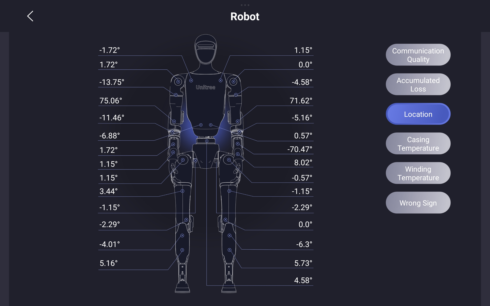

import G1_APP_CONN_01_IMG from './img/g1_app_conn_01.jpg';    
import G1_APP_CONN_02_IMG from './img/g1_app_conn_02.jpg';
import G1_APP_CONN_03_IMG from './img/g1_app_conn_03.jpg';
import G1_APP_CONN_04_IMG from './img/g1_app_conn_04.jpg';
import G1_APP_CONN_05_IMG from './img/g1_app_conn_05.jpg';
import G1_APP_CONN_06_IMG from './img/g1_app_conn_06.jpg';
import G1_SN_IMG from './img/unitree_robot_sn.png';

# G1 Diagnostics Guide

The G1 robot is a sophisticated system composed of multiple integrated components, including sensors, actuators, and control software. Malfunctions can arise from either hardware faults or software anomalies. When the robot does not behave as expected, it is essential to first isolate and identify the root cause. This guide provides step-by-step instructions for performing initial diagnostics and gathering key information that can be shared with our support team to facilitate effective troubleshooting and assistance.

## Behavior Analysis & Inspection

When the robot does not behave as expected, the first step is to carefully observe its behavior and conduct a visual inspection. We strongly recommend setting up a dedicated workspace with continuous video recording (e.g., surveillance cameras). This is especially useful for capturing intermittent or unpredictable issues that may occur when you're not actively monitoring the system.

If the event was not recorded, you can still examine the robot post-incident for signs of malfunction. Begin with a thorough visual inspection focused on the following areas:

* **Robot Body**: Check for any visible damage, such as cracks, dents, or impact marks that may indicate collisions or falls.
* **Sensors**: Ensure all sensors are clean, unobstructed, firmly mounted, and properly connected. Dust or misalignment can cause degraded performance.
* **Cables and Connectors**: Inspect for loose plugs, frayed wires, or damaged insulation. Confirm that all connections are secure and seated properly.
* **Battery**: Look for signs of swelling, leakage, or deformation. Ensure the battery is correctly installed and shows no abnormal wear.
* **LED Indicators**: Observe the LED strip color for motion mode identification:
  - **Solid Blue**: Normal Operation mode
  - **Solid Orange**: Damping Mode
  - **Solid Green**: Seated Mode
  - **Solid Yellow**: Debug Mode
  - **Solid Purple**: Zero-Torque Mode
  - **Solid Dark Blue**: Standby Mode
  - **Solid Red**: Error State

## Mobile App Diagnostics Data

You may also use the Unitree mobile app to check the robot's diagnostic information. You can download the Unitree mobile app with the QR code on [this page](https://www.unitree.com/app/g1):

To acquire the robot's diagnostic information, you need to connect your mobile device to the robot first. G1 supports both AP mode and WiFi mode. Unitree provides a [tutorial video](https://www.unitree.com/images/4272b99b2fe34a2aa8ff5fcdbb20c550.mp4) for using WiFi mode. The following screenshots quickly guide you through the process of connecting to the robot using AP mode.

    

        

            
            
Step 1. Select the Robot

        

    

    

        

            
            
Step 2. Choose AP Mode

        

    
    

    

        

            
            
Step 3. Create the Robot's AP Password

        

    

    

        

            
            
Step 4. Wait for AP Creation

        

    
    

    

        

            
            
Step 5. Connect Device to the Robot's AP

        

    

    

        

            
            
Step 6. Wait for Successful Connection

        

    
    

Once connected, you can access the robot's diagnostic information by navigating to `Device`->`Data`:

|                                       |                                         |
| ------------------------------------- | --------------------------------------- |
|     |     |

### Robot Alarm Information

### Robot Joint State

|                                       |                                         |
| ------------------------------------- | --------------------------------------- |
|     |     |
|  |  |
|     |     |

## Reporting the Issue

When reaching out to our support team, please provide a structured and detailed account of the problem. Please consider the following questions when reporting the issue:

* What actions or commands were executed just before the issue occurred?
* How did the robot behave during and immediately after the incident?
* Were there any error messages, warning tones, or abnormal movements? (*Alarms may be reset when the robot is restarted.*)
* Are there any visible signs of physical damage or wear?

Please attach screenshots taken from the mobile app, including diagnostic data and alarm information. If available, include relevant video footage. This helps us understand and reproduce the issue more effectively. 

Understanding and documenting the issue clearly will help prevent further damage and ensure safe continuation of your development or testing efforts.

> Before transporting the robot to Weston Robot Office for servicing, please **unbind** the robot from your mobile app account.   
> ***Note**: Serial Number of the robot is located in the battery compartment and through the app.*
>    