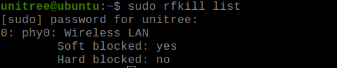

# G1 Internet Access Guide


This guide details 2 methods to provide the internal development PC (192.168.123.164) internet access.
The first method utilises the WiFi card onboard the internal development PC to connect to a WiFi Access Point with internet access.
The second method configures a host computer to connect to the internal development PC using a static IP over Ethernet and share internet access from the host.

## Method 1: Connect Internal Development PC to WiFi

1. Show Network Devices
```bash
lshw -C network
```
[](./img/lshw.png)

2. Check Wi-Fi Block Status
```bash
sudo rfkill list
```
[](./img/rfkill_list.png)

If Wi-Fi is blocked, unblock it:
```bash
sudo rfkill unblock wlan
```
3. Enable WiFi
```bash
sudo nmcli radio wifi on
```
4. Connect to a WiFi Network
```bash
sudo nmcli device wifi connect <SSID> password <password>
```
5. Test
```bash
ping 8.8.8.8
```

## Method 2: Network Sharing Between Host and Internal Development PC

### Step 1: Configure Static IP on Robot (Internal Development PC)

Create a Netplan config file
```bash
sudo nano /etc/netplan/01-network-manager-all.yaml
```
Paste the following into the file:
```bash
network:
  version: 2
  renderer: NetworkManager
  ethernets:
    eth0:  # replace with the unassigned ethernet interface
      dhcp4: no
      addresses: [192.168.1.2/24]
      nameservers:
        addresses: [8.8.8.8, 8.8.4.4]
```
*Note: The internal development PC has 2 ethernet interfaces (eth0 and eth1). One of the interfaces will already be assigned an IP of 192.168.123.164. **Please do not configure this interface in the netplan config file, instead use the unassigned interface.***

Test the Netplan configuration
```bash
sudo netplan try
```
Press the "Enter" key when prompted.

### Step 2: Configure Static IP on Host (Your Computer)

Assign a static IP to your host’s Ethernet interface that is in the same subnet, e.g., 192.168.1.1.
```bash
sudo nmcli con modify <ethernet_interface_name> ipv4.addresses 192.168.1.1/24
sudo nmcli con modify <ethernet_interface_name> ipv4.method manual
sudo nmcli con up <ethernet_interface_name>
```
###  Step 3: Enable Internet Sharing on the Host

For this sample setup, we'll use the interfaces below. Please change the interfaces according to your host computer

Ethernet to robot is: enx34298f73882f

Internet interface is: wlp0s20f3 (WiFi) or enp0s31f6 (LAN)

1. Enable IP Forwarding
Check if enabled:
```bash
cat /proc/sys/net/ipv4/ip_forward
```
If it returns 0, enable it:
```bash
echo "1" > /proc/sys/net/ipv4/ip_forward
```
2. Set Up NAT and Forwarding Rules
```bash
# Replace wlp0s20f3 with your actual internet interface
# Replace enx34298f73882f with your robot ethernet interface

sudo iptables --table nat --append POSTROUTING --out-interface wlp0s20f3 -j MASQUERADE
sudo iptables --append FORWARD --in-interface enx34298f73882f --out-interface wlp0s20f3 -j ACCEPT
sudo iptables --append FORWARD --in-interface wlp0s20f3 --out-interface enx34298f73882f -m state --state RELATED,ESTABLISHED -j ACCEPT
```
3. Verify the NAT Rule Exists
```bash
sudo iptables -t nat -L -n -v
```
*Look for a MASQUERADE rule under POSTROUTING.*

### Step 4: Test the Connection

#### On the robot (internal computer):
1. Check IP address:
```bash
ifconfig
```
2. Ping the host computer:
```bash
ping 192.168.1.1
```
3. Try pinging a public IP:
```bash
ping 8.8.8.8
```