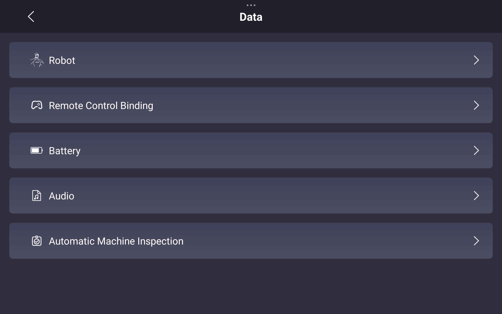

import GO2_APP_CONN_01_IMG from './img/go2_app_conn_01.jpg';    
import GO2_APP_CONN_02_IMG from './img/go2_app_conn_02.jpg';
import GO2_APP_CONN_03_IMG from './img/go2_app_conn_03.jpg';
import GO2_APP_CONN_04_IMG from './img/go2_app_conn_04.jpg';
import GO2_STARTUP_IMG from './img/Go2_startup_position.png';
import GO2_FIRMWARE_IMG from './img/unitree_firmware_update.png';
import GO2_CALIBRATION_IMG from './img/quadruped_calibration.png';
import GO2_SN_IMG from './img/unitree_robot_sn.png';

# Go2 Diagnostics Guide

The Go2 robot is a sophisticated quadruped system with 12 degrees of freedom, composed of multiple integrated components including sensors, actuators, and control software. Malfunctions can arise from either hardware faults or software anomalies. When the robot does not behave as expected, it is essential to first isolate and identify the root cause. This guide provides instructions for performing initial diagnostics and gathering key information that can be shared with our support team to facilitate effective troubleshooting and assistance.

## Behavior Analysis & Inspection

When the robot does not behave as expected, the first step is to carefully observe its behavior and conduct a visual inspection. We strongly recommend setting up a dedicated workspace with continuous video recording (e.g., surveillance cameras). This is especially useful for capturing intermittent or unpredictable issues that may occur when you're not actively monitoring the system.

If the event was not recorded, you can still examine the robot post-incident for signs of malfunction. Begin with a thorough visual inspection focused on the following areas:

* **Robot Body**: Check for any visible damage, such as cracks, dents, or impact marks that may indicate collisions or falls.
* **Sensors**: Ensure all sensors are clean, unobstructed, firmly mounted, and properly connected. Dust or misalignment can cause degraded performance.
* **Cables and Connectors**: Inspect for loose plugs, frayed wires, or damaged insulation. Confirm that all connections are secure and seated properly.
* **Battery**: Look for signs of swelling, leakage, or deformation. Ensure the battery is correctly installed and shows no abnormal wear.
* **LED Indicators**: Observe the head pilot lamp for status indication:
  - **Green flash**: Switching on
  - **Green solid**: Powered on, obstacle avoidance enabled  
  - **Blue solid**: Obstacle avoidance disabled
  - **Purple solid**: Companion mode
  - **Blue slow flash**: Motor & IMU calibration in progress
  - **Yellow slow flash**: Low battery warning (will crouch within 10 minutes)
  - **Red slow flash**: System abnormality, boot failure, hardware failure
  - **Red fast flash**: Motor & IMU calibration failed

## Mobile App Diagnostics Data

You may also use the Unitree mobile app to check the robot's diagnostic information. You can download the Unitree mobile app with the QR code on [this page](https://www.unitree.com/app/go2):

To acquire the robot's diagnostic information, you need to connect your mobile device to the robot first. Go2 supports both AP mode and Wi-Fi mode. Unitree provides [tutorial videos](https://www.unitree.com/app/go2) for adding Go2 and using app features. The following screenshots quickly guide you through the process of connecting to the robot using AP mode.

    

        

            
            
Step 1. Select the Robot

        

    

    

        

            
            
Step 2. Choose AP Mode

        

    
    

    
    

        

            
            
Step 3. Create the Robot's AP Password

        

    

    

        

            
            
Step 4. Connect Device to the Robot's AP

        

    

Once connected, you can access the robot's diagnostic information by navigating to `Device`->`Data`:

|                                       |                                         |
| ------------------------------------- | --------------------------------------- |
|     |     |

### Robot Alarm Information

### Robot Motor Information

|                                       |                                         |
| ------------------------------------- | --------------------------------------- |
|     |     |
|  |  |
|  |

## General Troubleshooting
This guide provides general instructions to troubleshoot, identify, and resolve common issues.

1. **Initial Startup Position**  
    Ensure the robot is in this position prior to startup.
    
    1. Place the robot onto a flat and levelled ground.
    2. Ensure each leg joint is hand closed as shown in the image above.
    3. Ensure 2 points of contact for each leg.

2. **Using Mobile App for Diagnostic Check**   
    After binding the robot to your account, check for any warnings, errors, or potential signs of failure in the app.
    - Check for robot updates and upgrade to the latest firmware for bug fixes and new features.
        
        
        *Note: For EDU versions, updates may affect software development. Refer to [Unitree Go2 Documentation](https://support.unitree.com/home/en/developer/about_Go2) for more information.*

    - Calibrate the **IMU** and **motors** only when deemed necessary *(e.g., robot unable to walk in a straight line, limping, or tilted)*. Refer to the [official tutorial videos](https://www.unitree.com/app/go2).
           

3. **Hardware Check**
    - Replace any foot pads with bald spots or excessive wear.
    - Move each joint through its range of motion.
    - Listen for any unusual sounds that may indicate mechanical issues.

## Reporting the Issue

When reaching out to our support team, please provide a structured and detailed account of the problem. Please consider the following questions when reporting the issue:

* What actions or commands were executed just before the issue occurred?
* How did the robot behave during and immediately after the incident?
* Were there any error messages, warning tones, or abnormal movements? (*Alarms may be reset when the robot is restarted.*)
* Are there any visible signs of physical damage or wear?

Please attach screenshots taken from the mobile app, including diagnostic data and alarm information. If available, include relevant video footage. This helps us understand and reproduce the issue more effectively. 

Understanding and documenting the issue clearly will help prevent further damage and ensure safe continuation of your development or testing efforts.

*Note: Serial Number of the robot is located in the battery compartment and through the app.*
   